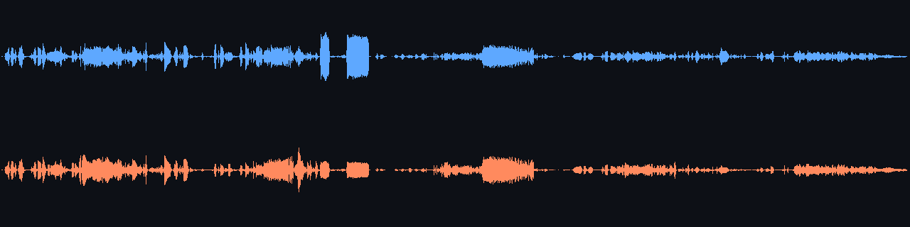

<p align="center">
  
</p>

# puntorigen/skills

Local-first agent skills for Cursor and other AI coding agents. Almost every
skill runs **on your machine** — no cloud APIs, no API keys. Most are optimized
for **Apple Silicon Macs** (MLX / MPS / Metal). Even [`brand-logo-kit`](#brand-logo-kit),
the one skill that _can_ reach the cloud, is **local-first**: it prefers on-device
FLUX.2 Klein for logos and only falls back to a Gemini/OpenRouter key (which it
reuses from your environment, never bundling one) when local can't run.

Install with the [skills CLI](https://skills.sh/):

```bash
npx skills add puntorigen/skills              # install all
npx skills add puntorigen/skills@talking-head # one skill
npx skills add puntorigen/skills -g -y        # global install, skip prompts
```

Browse: [skills.sh/puntorigen/skills](https://skills.sh/puntorigen/skills)

## Available skills

### image-gen

Generate hyper-realistic images from a text prompt at any resolution, locally
with mflux (Z-Image-Turbo or FLUX.2-klein). Optional SeedVR2 upscaling.

```bash
npx skills add puntorigen/skills@image-gen -g -y
```

**Requires:** Apple Silicon Mac, uv, ~6 GB disk for default model.

---

### voice-clone-narration

Clone a voice from a short sample or design one from a description. Generate
expressive MP3 narrations in English or Spanish with Chatterbox / Qwen3-TTS.

```bash
npx skills add puntorigen/skills@voice-clone-narration -g -y
```

**Requires:** Python 3.11, ffmpeg, ~5 GB disk. Voice design is Apple Silicon only.

---

### bg-music

Generate royalty-free instrumental background music from a text brief with
ACE-Step 1.5. Mix under a voiceover with automatic ducking.

```bash
npx skills add puntorigen/skills@bg-music -g -y
```

**Requires:** uv, git, ffmpeg, ~10 GB disk. Best on Apple Silicon.

---

### sound-effects

Generate sound effects, foley, and ambience (door slams, footsteps, rain, wind,
UI blips, whooshes) from a text prompt with Stable Audio Open Small (via
mlx-audiogen). Tuned for SFX and field recordings, up to ~11s stereo.

```bash
npx skills add puntorigen/skills@sound-effects -g -y
```

**Requires:** Apple Silicon Mac, uv, ffmpeg, ~1-2 GB disk. Weights are public
(no HF account/token needed); under the Stability AI Community License (free
under $1M revenue).

---

### audio-theater

Turn a dialogue, story, or idea into finished multi-character audio — a radio
drama, a two-host podcast, or clean lip-sync clips — by orchestrating
`voice-clone-narration` (one voice per character), `sound-effects` (foley), and
`bg-music` (score), then mixing with ffmpeg (ducking + optional stereo
spatialization). Delivers the full mix plus music/no-music stems and a timecoded
transcript.

```bash
npx skills add puntorigen/skills@audio-theater -g -y
```

**Requires:** ffmpeg + the `voice-clone-narration` skill (required); optional
`sound-effects` and `bg-music` for SFX/music cues. No venv of its own.

---

### talking-head

Turn a portrait image + narration audio into a lip-synced talking-head MP4 with
JoyVASA and LivePortrait. Composes with `image-gen` and `voice-clone-narration`.

```bash
npx skills add puntorigen/skills@talking-head -g -y
```

**Requires:** Apple Silicon Mac, uv, git, ffmpeg, ~6 GB disk.

---

### video-to-splat

Convert an mp4 walkthrough into a 3D Gaussian splat (PLY/SOG) and preview it
in a bundled Aholo viewer. Full local photogrammetry pipeline.

```bash
npx skills add puntorigen/skills@video-to-splat -g -y
```

**Requires:** Apple Silicon Mac (macOS 14+), uv, ffmpeg, node, Chrome/Edge 134+.

---

### object-to-3d

Turn an mp4 of an orbited object into a clean, browser-navigable Gaussian splat
**and** a watertight, millimeter-scaled STL/GLB mesh for 3D printing. Extends the
`video-to-splat` pipeline with automatic splat cleanup and printable mesh
extraction - Poisson reconstruction plus base-down orientation, voxel
solidify and a flat print base, with in-browser Splat and Print previews
(open3d + trimesh + scikit-image).

```bash
npx skills add puntorigen/skills@object-to-3d -g -y
```

**Requires:** Apple Silicon Mac (macOS 14+), uv, ffmpeg, node, a WebGL2 browser.

---

### generate-web-skills

Record a real Chrome session (HAR + UI steps), distill it into a reusable
lesson, then replay the action with different parameters or record UI proof.

```bash
npx skills add puntorigen/skills@generate-web-skills -g -y
```

**Requires:** Node.js, Google Chrome, python3, ffmpeg (for mp4 proof). See
[generate-web-skills/README.md](generate-web-skills/README.md).

---

### edit-docx

Inspect and edit Microsoft Word `.docx` files while preserving formatting,
styles, and layout — run-aware find/replace, insert paragraphs, edit table
cells, add rows, delete elements — all locally with python-docx.

```bash
npx skills add puntorigen/skills@edit-docx -g -y
```

**Requires:** Python 3.9+ (any OS). Optional `uv` for a faster install.

---

### pdf-documents

Read PDFs with real layout understanding (Docling → structured JSON/Markdown,
tables, sections, OCR) and create professional multi-page PDFs from a JSON
config (fpdf2 → titles, styled tables, images, lists, headers/footers) — all
locally.

```bash
npx skills add puntorigen/skills@pdf-documents -g -y
```

**Requires:** Python 3.9+ (any OS), ~1-2 GB disk for Docling models (first read).

---

### j-space

Build and use an external, persistent **mental workspace** for an agent, modeled
on the "J-space" from [Anthropic's global-workspace research](https://www.anthropic.com/research/global-workspace).
Turn a topic (Perplexity/web research) or a codebase (`scan`) into a weighted
concept graph, compile it into a matrix with local embeddings, then `load`,
`query` (spreading activation), `edit`, `checkpoint`, and even `hypnotize` the
workspace — pin concepts, install triggers, and write an always-on induction rule
that primes the agent every session.

```bash
npx skills add puntorigen/skills@j-space -g -y
```

**Requires:** Python 3.11+, uv, ~500 MB disk for the venv + `all-MiniLM-L6-v2`
embedding model (public, no HF account; MPS or CPU, any platform). See
[j-space/README.md](j-space/README.md).

---

### brand-logo-kit

Generate a **logo** and a matching, **brand-consistent** asset set — wordmarks,
monograms, app icons, favicons, social avatars, banners, seamless patterns, and
spot illustrations. Pick a logo, set the name in a **real font** (`wordmark.py`),
extract the palette, and keep the whole set cohesive with a shared `--look`.

```bash
npx skills add puntorigen/skills@brand-logo-kit -g -y
```

> **Local-first, with a cloud fallback.** By default it renders **on-device** via
> the local `image-gen` skill (FLUX.2 Klein, Apple Silicon) — no key, no cloud —
> chosen automatically when there's an Apple Silicon Mac with enough disk for the
> weights. When local can't run it falls back to the **cloud** (Gemini / OpenRouter
> Nano Banana Pro), bundling **no API key**: it auto-discovers `GEMINI_API_KEY` /
> `OPENROUTER_API_KEY` from your environment or another installed skill and caches
> it **outside** the repo. `--look` presets steer the finish, and `wordmark.py`
> sets brand text from genuine fonts (no misspelled diffusion text).

**Requires:** Python 3.9+ (any OS). For the preferred local path: an Apple Silicon
Mac + the `image-gen` skill. For the cloud fallback: a Gemini or OpenRouter API key
(auto-discovered). Optional `uv` for a faster install.

## End-to-end reel workflow

These skills compose into a fully local content pipeline:

```
image-gen  →  avatar.png
voice-clone-narration  →  narration.mp3
talking-head  →  talking-head.mp4
bg-music  →  reel-audio.mp3 (optional mix)

# or a full audio drama / podcast:
audio-theater  →  orchestrates voice-clone-narration + sound-effects + bg-music
               →  final.mp3 (+ music / no-music stems) + transcript.md
               →  clean per-line clips → talking-head (on-camera lip-sync)
```

Install the set:

```bash
npx skills add puntorigen/skills \
  -s image-gen,voice-clone-narration,bg-music,sound-effects,audio-theater,talking-head \
  -g -y
```

Each skill stores models and outputs **outside the repo** (under `~/.*` home
dirs). First run of `scripts/setup_env.sh` downloads weights and may take
several minutes.

## Example: a 3-voice spatial radio drama

[`examples/audio-theater-storm/`](examples/audio-theater-storm/) is a complete,
reproducible `audio-theater` run — a ~50-second storm scene with **three distinct
designed voices** (no reference clips), **acted with per-line emotion**, and **four
spatialized sound effects**, mixed to a stereo stage. 100% local, no cloud, no
Hugging Face account.

**▶ Hear it** — [download / play the 51-second demo (MP4)](https://github.com/puntorigen/skills/raw/main/assets/audio-theater-storm-demo.mp4):

https://github.com/user-attachments/assets/2a7a6fa6-e638-49a7-a8b7-1a332738a262
<!-- Inline player: GitHub only renders one for its own user-attachments CDN,
     not for committed raw files. Paste the https://github.com/user-attachments/assets/<id>
     URL (from uploading the mp4 via GitHub's web UI) on its own line here. -->



_Static preview of the mix — left channel (blue) over right (orange). They differ
because each voice and one-shot sits at its own pan/distance; e.g. the left-heavy
burst is the door slam on Mara's side of the stage._

The story and cues are authored as small JSON files; the agent then drives the
sibling skills:

```bash
OUT=examples/audio-theater-storm
SC=audio-theater/scripts

python3 $SC/setup_cast.py       --out $OUT                             # design 1 voice / character
python3 $SC/generate_voices.py  --script $OUT/script.json --out $OUT --seed 700  # -> dialogue.wav + lines.json
python3 $SC/generate_sfx.py     --cues   $OUT/cues.json   --out $OUT   # ambient bed + one-shots
python3 $SC/mix_spatial.py      --out $OUT                             # -> final.mp3 (stereo stage)
python3 $SC/build_transcript.py --out $OUT                             # -> transcript.md
```

Each line is **acted**: an `emotion` (+ `intensity`) drives Chatterbox's
exaggeration/cadence, and a theater `expressiveness` boost widens the dynamic range
so calm lines sit calm and the panic actually spikes:

```jsonc
// script.json — cast seated on the stage, each line given a delivery
"expressiveness": 1.25,
"characters": [
  { "name": "Narrator", "role": "narration", "tone": "warm", "stage": { "pan": 0.0,  "distance": 0.12 } },
  { "name": "Mara",     "persona": "weathered lighthouse keeper, low and steady", "tone": "firm",
    "stage": { "pan": -0.4, "distance": 0.2 } },
  { "name": "Tomas",    "persona": "nervous young apprentice, higher and breathy", "tone": "nervous",
    "stage": { "pan": 0.45, "distance": 0.22 } }
],
"lines": [
  { "index": 3, "speaker": "Tomas", "text": "I'm trying! The latch won't hold!", "emotion": "panicked", "intensity": 0.8 }
]

// cues.json — a hard-left door slam on Mara's side (short, concrete prompt + quality knobs)
{ "id": "door", "type": "oneshot", "description": "heavy wooden door slams shut, sharp wooden bang",
  "start": 17.9, "gen_seconds": 3, "steps": 24, "sampler": "rk4",
  "negative_prompt": "music, animal, roar, voice", "spatial": { "pan": -0.55, "distance": 0.15 } }
```

The rendered [`transcript.md`](examples/audio-theater-storm/transcript.md) and the
input JSON are committed; the audio (`*.mp3`/`*.wav`) is git-ignored — run the
commands above to hear it. See the
[example README](examples/audio-theater-storm/README.md) for the full walkthrough.

## Repo layout

```
skills/
├── README.md
├── skills.sh.json          # optional grouping for skills.sh
├── image-gen/
│   ├── SKILL.md            # required — agent instructions + frontmatter
│   ├── REFERENCE.md        # optional deep reference
│   └── scripts/
├── voice-clone-narration/
├── bg-music/
├── sound-effects/
├── audio-theater/
├── talking-head/
├── video-to-splat/
├── object-to-3d/
├── generate-web-skills/
├── edit-docx/
├── pdf-documents/
├── j-space/
├── brand-logo-kit/         # local-first (FLUX.2 Klein) + cloud fallback — logos & brand assets
└── examples/
    └── audio-theater-storm/   # worked audio-theater example (script + cues + transcript)
```

## Verify locally before publishing

```bash
# From this repo root:
npx skills add . --list

# Dry-run install one skill:
npx skills add .@talking-head -g -y
```

## Development

Scaffold a new skill:

```bash
npx skills init my-new-skill
```

Each `SKILL.md` needs YAML frontmatter with `name` and `description`. See
[agentskills.io](https://agentskills.io/) and existing skills here for
conventions.

## License

Skill instructions and scripts in this repo are MIT unless noted otherwise.
Bundled model weights retain their upstream licenses (ACE-Step MIT, Chatterbox
MIT, Qwen3-TTS Apache-2.0, Z-Image/FLUX Apache-2.0, etc.) — see each skill's
`REFERENCE.md`.

> **Note on `sound-effects`:** Stable Audio Open Small weights are under the
> [Stability AI Community License](https://stability.ai/license) — free for
> research and for individuals/organizations under **$1M USD annual revenue**, but
> not as permissive as the Apache/MIT models above. The `audio-theater` skill
> inherits this when it generates SFX. Review before commercial use.
