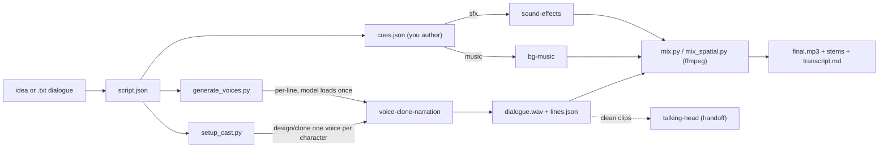

# Audio Theater

Compose finished multi-character audio from a script or idea, fully offline. This
skill is an **orchestrator**: it has no models of its own. It drives three local
sibling skills and mixes their output with ffmpeg.

- **voice-clone-narration** -> one cloned/designed voice per character; one clean
  clip per line (these clips double as lip-sync reference).
- **sound-effects** -> foley / ambience cues (Stable Audio Open Small).
- **bg-music** -> instrumental score / beds / jingles (ACE-Step 1.5).



Project outputs go to a folder you pass as `--out` (e.g. `audio-theater/<slug>/`).
The sibling skills keep their venvs and model weights **outside the repo** under
their own `~/.<skill>/` homes.

## Prerequisites

- **ffmpeg + ffprobe** on PATH (`brew install ffmpeg`). Required.
- **voice-clone-narration** installed and set up. Required (it makes the voices).
- **sound-effects** and **bg-music** installed and set up. Optional - SFX/music
  cues are simply skipped if their skill is absent, so the drama still renders.
- **Apple Silicon** for the sibling model skills (and for voice *design*). Off
  Apple Silicon, provide reference clips for cloning instead of designing voices.
- Python 3 (stdlib only for this skill).

## Setup

This skill installs no venv. Run its check to confirm the siblings are ready:

```bash
SKILL_DIR="<the folder this SKILL.md lives in>"   # e.g. .cursor/skills/audio-theater
bash "$SKILL_DIR/scripts/setup_env.sh"
SCRIPTS="$SKILL_DIR/scripts"
```

It prints, for each sibling, whether it is set up and the exact `setup_env.sh` to
run if not. Set up the siblings first (each is a one-time step):

```bash
bash <voice-clone-narration>/scripts/setup_env.sh   # required
bash <sound-effects>/scripts/setup_env.sh            # optional (SFX)
bash <bg-music>/scripts/setup_env.sh                 # optional (music)
```

## Modes

| Mode | Output | Use it for |
|------|--------|-----------|
| `theater` (default) | `final.mp3` (dialogue + SFX + music, ducked) + stems when there's music + `transcript.md` | Dramatized radio play / audio drama |
| `podcast` | `final.mp3` (2 hosts + intro/bed/outro music) + stems + show-notes `transcript.md` | Podcast episodes |
| `lipsync` | clean `lines/*.wav` clips + `lipsync.json` | Audio reference for the **talking-head** skill |

## Workflow

Copy this checklist and track progress:

```
- [ ] 1. Get a script.json (author it, or parse a .txt with write_script.py)
- [ ] 2. Cast: setup_cast.py (design or clone one voice per character)
- [ ] 3. Voices: generate_voices.py -> dialogue.wav + lines.json
- [ ] 4. (theater/podcast) Author cues.json (SFX + music placements)
- [ ] 5. (theater/podcast) generate_sfx.py -> sfx/*.mp3
- [ ] 6. (theater/podcast) mix.py (or mix_spatial.py) -> final.mp3 (+ stems)
- [ ] 7. build_transcript.py -> transcript.md
- [ ] (lipsync) export_lipsync.py / split_tracks.py -> talking-head handoff
```

### 1. Get a script (`script.json`)

The pipeline runs on a `script.json` (schema below). Two ways in:

- **From an idea/brief -> you author it.** There is no cloud LLM here; **you (the
  agent) are the scriptwriter.** Write `$OUT/script.json` directly following the
  schema (title, language, mode, characters with a `persona`, and lines).
- **From an existing dialogue `.txt`** (lines like `Marco: La tormenta se acerca.`):

```bash
python3 $SCRIPTS/write_script.py --script-file dialogo.txt --mode theater --language es --out $OUT
```

Review/edit `script.json` (personas, tags, pauses) before generating audio.

### 2. Cast the voices (`setup_cast.py`)

Give each character its own voice - designed from the `persona` (Apple Silicon)
or cloned from a reference clip you provide:

```bash
# design a voice per character from its persona (Apple Silicon):
python3 $SCRIPTS/setup_cast.py --out $OUT
# or clone from reference clips (works off Apple Silicon too):
python3 $SCRIPTS/setup_cast.py --out $OUT --clip "Marco=marco.m4a" --clip "Ines=ines.wav"
```

Voices are namespaced `at-<project>-<character>` and written back into
`script.json`. Play the audition mp3s (under `~/.voice-clone-narration/out/`) and
re-run with an adjusted `persona`/`--describe` if you want a different voice.

### 3. Generate the voices (`lines/*.wav`, `dialogue.wav`, `lines.json`)

```bash
python3 $SCRIPTS/generate_voices.py --script $OUT/script.json --out $OUT
```

One clean clip per line, synthesized in a single pass (the TTS model loads once),
concatenated into `dialogue.wav` with exact timing in `lines.json`. Line `tags`
(e.g. `whispers`, `excited`, `angry`) map to expressiveness presets. It warns if
a clip exceeds `--max-clip-seconds` (keep lines short for lip-sync).

### 4. (theater/podcast) Author the SFX/music sheet (`cues.json`)

**You (the agent) write `$OUT/cues.json`** by reading `script.json` + `lines.json`
and placing sound where it makes sense (use the line start/end times in
`lines.json` to anchor one-shots). Cue `type` is `ambient`, `oneshot`, or
`music`. Schema below.

### 5. (theater/podcast) Generate the cued sounds (`sfx/*.mp3`)

```bash
python3 $SCRIPTS/generate_sfx.py --cues $OUT/cues.json --out $OUT
```

`ambient`/`oneshot` cues render via the **sound-effects** skill; `music` cues via
**bg-music** (always instrumental). Files land in `$OUT/sfx/` and durations are
written back into `cues.json`. Missing sibling skills cause those cues to be
skipped (the mix still renders).

### 6. (theater/podcast) Mix (`final.mp3` + stems)

```bash
python3 $SCRIPTS/mix.py --dialogue $OUT/dialogue.wav --cues $OUT/cues.json --out $OUT
```

One-shots are placed at their timecode; ambient beds are looped/trimmed to
`[start,end]` with fades and **sidechain ducking** keyed off the dialogue. **Music
behaves like a background score:** it sits well below the dialogue and gently
lowers under the whole *content* (voices + SFX) with a smooth, shallow duck (no
pumping, never above the voices). Everything is summed and loudness-normalized.

**Stems (`--stems`, default `auto`).** When the project has `music` cues, the
mixer also writes `final.nomusic.mp3` (dialogue + SFX) and `final.music.mp3`
(music only), sharing one gain so `final = nomusic + music`.

**Spatial mix (optional, theater).** `mix_spatial.py` places each voice line and
one-shot SFX on a virtual stereo stage (pan + distance + movement) instead of the
flat center mix - see REFERENCE.md.

### 7. Build the transcript (`transcript.md`)

```bash
python3 $SCRIPTS/build_transcript.py --out $OUT
```

Timecoded transcript with `[SFX: id]` placeholders (theater/lipsync) or speaker
show-notes (podcast), plus a table of the SFX/music used.

### (lipsync mode) Hand off to talking-head

```bash
python3 $SCRIPTS/export_lipsync.py --out $OUT   # -> lipsync.json (per-clip manifest)
```

The clean per-line clips are lip-sync references. Make one front-facing,
mouth-closed avatar per on-camera character with the **image-gen** skill, then run
the **talking-head** skill per clip (`animate.py --image <avatar>.png --audio
<clip> --crop --out <mp4>`). To separate an off-camera narrator from on-camera
speakers, use `split_tracks.py` (see REFERENCE.md).

## script.json schema

```json
{
  "title": "La tormenta",
  "language": "es",
  "mode": "theater",
  "characters": [
    {"name": "Marco", "persona": "marinero veterano, voz grave y cansada, 50s", "stage": {"pan": -0.35, "distance": 0.18}},
    {"name": "Inés", "persona": "joven grumete, voz ligera y nerviosa", "stage": {"pan": 0.4}},
    {"name": "Narrador", "role": "narration", "on_camera": false, "persona": "voz cálida que cuenta la historia"}
  ],
  "lines": [
    {"index": 0, "speaker": "Marco", "text": "La tormenta se acerca, muchacha.", "tags": ["serious", "tired"], "pause_after": 0.4},
    {"index": 1, "speaker": "Inés", "text": "¿Llegaremos a puerto?", "tags": ["panicked"], "pause_after": 0.2,
     "spatial": {"from": {"pan": 0.6, "distance": 0.6}, "to": {"pan": 0.2, "distance": 0.15}}}
  ]
}
```

- `language`: 2-letter content language (`es`, `en`, ...); passed to the voice
  model. For non-English, delivery `cfg_weight` is nudged down to reduce accent
  transfer.
- `persona`: **drives voice design** - describe age, gender, pitch, pace, tone,
  accent. Used by `setup_cast.py`. (`voice` is filled in by `setup_cast.py`; you
  normally leave it out.)
- `tags`: optional delivery cues (`whispers`, `excited`, `tired`, `angry`,
  `dramatic`, ...) mapped to Chatterbox exaggeration/cfg-weight presets. You can
  also set per-line `exaggeration`/`cfg_weight` numbers directly.
- `pause_after`: seconds of silence appended after the line (default 0.3).
- `role` / `on_camera`: mark off-camera narration (`"role": "narration"` or
  `"on_camera": false`); used by `split_tracks.py` and the spatial mixer.
- `stage` / `spatial`: optional positions for `mix_spatial.py` (ignored by
  `mix.py`) - see REFERENCE.md.

## cues.json schema

```json
{"cues": [
  {"id": "rain_bed", "type": "ambient", "description": "steady rain on a wooden deck, no music",
   "start": 0.0, "end": 42.0, "gain_db": -18, "duck_db": -8, "fade_in": 1.5, "fade_out": 2.0},
  {"id": "door_slam", "type": "oneshot", "description": "heavy wooden door slamming shut",
   "start": 12.6, "gen_seconds": 3, "gain_db": -6, "spatial": {"pan": 0.0, "distance": 0.1}},
  {"id": "story_score", "type": "music", "mood": "cinematic",
   "description": "soft mystical underscore, slow strings, low and unobtrusive",
   "start": 0.0, "end": 120.0, "gain_db": -22, "duck_db": -8, "fade_in": 3.0, "fade_out": 4.0}
]}
```

- `type`: `ambient` (looping bed, ducked under voice), `oneshot` (single hit at
  `start`), `music` (instrumental score/bed/jingle).
- `description`: natural-language prompt. For **repeated/continuous** SFX describe
  the whole sequence ("several footsteps on gravel"), not one hit. Add "no music"
  for pure foley.
- `gain_db`: level offset - **dialogue is always on top**. One-shots ~`-12..-6`,
  SFX beds `-18..-15`, **music score lowest `-24..-20`**. `duck_db`: how much the
  cue dips while content plays (`-4..-8`; music's duck is shallow + smooth).
- `start`/`end`/`fade_in`/`fade_out` in seconds. `gen_seconds` pins a one-shot's
  generated length (SFX cap ~11s; beds are looped by the mixer).
- `mood` (music): a hint for bg-music (`cinematic`, `ambient`, `podcast-bed`,
  `podcast-intro`, `pet-lullaby`, ...). `seed`/`bpm` optional.
- `spatial` (spatial mix only): position on the virtual stage - see REFERENCE.md.

## Safety

- **Disclose AI-generated audio** where the platform/context calls for it.
- **Consent & likeness:** clone a real person's voice only with permission; do not
  impersonate real people or create misleading content.
- **Licensing is inherited from the sibling skills.** Notably, **sound-effects**
  uses Stable Audio Open Small under the **Stability AI Community License** (free
  under $1M annual revenue; not Apache) - see that skill's docs before commercial
  use. voice-clone-narration and bg-music are more permissive.
- **Never upload** scripts, voices, or audio to any external service. Everything
  stays local.

## Anti-patterns

- Cranking `atempo` to hit a target length - budget the script (~2 words/sec) and
  cut lines instead; heavy speed-up sounds rushed.
- Making SFX/music louder than the voices - dialogue is always on top; keep music
  base levels low (`-24..-20`).
- Zig-zagging music position in the spatial mix - keep music fixed, or one gentle
  gesture (see REFERENCE.md).
- Feeding the full mix (with music) to talking-head - feed the clean per-line clip.
- Expecting video here - this skill is audio only; hand clips to **talking-head**.

## Resources

- Spatial mix authoring, stems/handoff recipes, narration-vs-on-camera split,
  pacing for fixed durations, troubleshooting: [REFERENCE.md](REFERENCE.md)
- Voices: **voice-clone-narration** · SFX: **sound-effects** · Music: **bg-music**
  · Lip-synced video: **talking-head** · Avatars: **image-gen**
