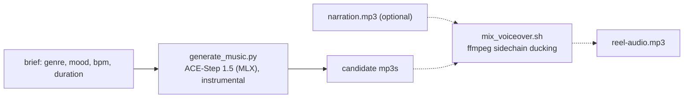

# Background Music

Generate original, royalty-free instrumental music for reels and demo videos from a
text brief - fully offline. A wrapper drives ACE-Step 1.5 (the music model);
**you** (the model) shape the brief into a good prompt, generate a couple of
candidates, let the user pick, and optionally mix the winner under a narration.

Pairs with the **voice-clone-narration** skill: generate the voiceover there, the
music here, then `mix_voiceover.sh` ducks the music under the narration for a
finished reel audio track.



Everything lives **outside the repo** at `~/.bg-music/` (the ACE-Step checkout,
model weights, and generated audio).

## Prerequisites

- **uv** (package manager) and **git** - the model is a `uv sync` app, not a plain
  pip install. Setup installs it into an isolated environment.
- **ffmpeg** on PATH (MP3 encoding + mixing). Stop and ask the user to
  `brew install ffmpeg` if missing.
- **~10 GB free disk** for the code + model weights (downloaded once from Hugging
  Face, anonymously - no token). Budget more if you pull larger model variants.
- **Apple Silicon Mac** for the fast native path (MLX). On CUDA/CPU it falls back
  to PyTorch (slower on CPU). 16 GB unified memory is enough for the default
  2B-turbo + 0.6B-LM tier.
- Internet on first run only (to fetch code + weights). Generation is offline.

## Setup

Resolve the skill directory and run setup once (clones ACE-Step 1.5 and syncs its
environment - the first run downloads dependencies and can take several minutes):

```bash
SKILL_DIR="<the folder this SKILL.md lives in>"   # e.g. .cursor/skills/bg-music
bash "$SKILL_DIR/scripts/setup_env.sh"
```

Then set the handles used by generation (setup prints these too):

```bash
BG_HOME="${BG_MUSIC_HOME:-$HOME/.bg-music}"
PY="$BG_HOME/ACE-Step-1.5/.venv/bin/python"
```

## Workflow

Copy this checklist and track progress:

```
- [ ] 1. Confirm the brief: genre, mood, tempo (BPM), duration, key instruments
- [ ] 2. Setup: run setup_env.sh (first time only)
- [ ] 3. Write a concrete prompt; generate 2 candidates
- [ ] 4. Play/link the candidates; let the user pick (regenerate if needed)
- [ ] 5. (optional) Mix the winner under a narration mp3 with ducking
- [ ] 6. Deliver the mp3(s)
```

### Step 1: Nail the brief

Music quality depends on a concrete prompt. Pull these from the user (or infer and
state your choices):

- **Genre/style**: lo-fi hip hop, cinematic orchestral, corporate ambient, synthwave, acoustic folk, upbeat pop...
- **Mood**: calm, uplifting, tense, dreamy, energetic, melancholic.
- **Tempo**: slow / medium / fast, or an explicit BPM (e.g. 90).
- **Duration**: seconds (10-600; reels are usually 30-120).
- **Key instruments** (optional): Rhodes piano, warm pads, soft drums, nylon guitar.

### Step 3: Generate

```bash
"$PY" "$SKILL_DIR/scripts/generate_music.py" \
  --prompt "warm lo-fi hip hop, mellow Rhodes piano, soft vinyl crackle, laid-back drums, loopable, instrumental" \
  --bpm 80 --duration 60 --count 2 \
  --out "$BG_HOME/out/lofi.mp3"
```

- Tracks are **instrumental by default** (no vocals).
- `--count 2` produces two variations to choose from (`lofi-1.mp3`, `lofi-2.mp3`).
- Writes MP3s and prints their paths + durations. First run downloads model
  weights; subsequent runs are much faster.

Good prompts are specific and comma-separated. Include genre + mood + 2-3
instruments + a tempo word + "instrumental"/"loopable". Examples:

- `"cinematic inspiring orchestral, soft strings, piano, subtle percussion building to a warm swell, instrumental"`
- `"clean corporate ambient, gentle synth pads, light plucks, optimistic, minimal, instrumental"`
- `"driving synthwave, analog bass, retro arpeggios, punchy drums, night-drive energy, instrumental"`

### Step 5: Mix under a narration (optional)

If the user also has a voiceover (e.g. from the voice-clone-narration skill), duck
the music under it automatically:

```bash
bash "$SKILL_DIR/scripts/mix_voiceover.sh" \
  --voice ~/.voice-clone-narration/out/test-en.mp3 \
  --music "$BG_HOME/out/lofi-1.mp3" \
  --out ~/Desktop/reel-audio.mp3
```

The music auto-lowers whenever the voice is talking (sidechain compression), then
comes back up in the gaps. It is looped to cover the narration and faded in/out.
Tune with `--music-gain` (bed level, default -8 dB), `--duck` (ducking strength,
default 8) and `--fade`.

### Step 6: Deliver

Embed or link the chosen mp3. Generated files stay under `~/.bg-music/out/`.

## Key options (generate_music.py)

| Option | Default | Purpose |
|--------|---------|---------|
| `--prompt` | (required) | Music description: genre, mood, instruments, vibe. |
| `--duration` | `60` | Length in seconds (10-600). |
| `--bpm` | auto | Tempo in BPM (30-300); omit to let the model choose. |
| `--count` | `2` | How many variations to generate. |
| `--out` | `out/music-<ts>.mp3` | Output path (or prefix when `--count > 1`). |
| `--seed` | random | Fix for reproducibility. |
| `--keyscale` | auto | Musical key, e.g. `"A minor"`. |
| `--vocals` | off (instrumental) | Allow vocals (rarely wanted for bg music). |
| `--steps` | `8` | Diffusion steps (turbo default; more = slower, marginally better). |
| `--mp3-quality` | `2` | ffmpeg `libmp3lame -q:a` (0=best..9=smallest). |
| `--keep-wav` | off | Keep the intermediate wav. |

## Key options (mix_voiceover.sh)

| Option | Default | Purpose |
|--------|---------|---------|
| `--voice` | (required) | Narration mp3/wav (stays at full level). |
| `--music` | (required) | Background music mp3/wav (gets ducked + looped to cover the voice). |
| `--out` | (required) | Output mixed mp3. |
| `--music-gain` | `-8` | Baseline music level in dB (lower = quieter bed). |
| `--duck` | `8` | Ducking strength (compressor ratio); higher = music drops more under speech. |
| `--fade` | `2` | Music fade-in/out seconds. |
| `--mp3-quality` | `2` | ffmpeg `libmp3lame -q:a`. |

## Safety

- **Disclose AI-generated music** where the platform or context calls for it.
- **Commercial use:** ACE-Step 1.5 is MIT-licensed and trained on licensed /
  royalty-free / synthetic data, so generated tracks are broadly safe to use.
  Still, per the model's own disclaimer, avoid prompts that copy a specific
  artist's or track's identity, and verify originality before commercial release.
- **Never upload** briefs, prompts, or generated audio to any external service.
  Everything stays local under `~/.bg-music/`.

## Anti-patterns

- Vague one-word prompts ("music", "something cool") - you get generic output.
  Give genre + mood + instruments + tempo.
- Asking for vocals when you only need a bed - keep it instrumental (the default)
  so it sits under narration cleanly.
- Generating one take and shipping it - generate `--count 2` and let the user pick.
- Overlaying music under a voiceover by hand - use `mix_voiceover.sh` so the music
  ducks under speech automatically.
- Prompting for "a song that sounds exactly like <artist/track>" - originality and
  licensing risk.
- Committing anything from `~/.bg-music/` into a repo.

## Resources

- Model zoo (why 2B-turbo on 16 GB), the full parameter cheatsheet, prompt
  patterns by mood, licensing rationale, and troubleshooting: [REFERENCE.md](REFERENCE.md)
- Generating the narration to mix under the music: the **voice-clone-narration** skill.
- Verifying the final audio in a video: the **review-mp4** skill.
