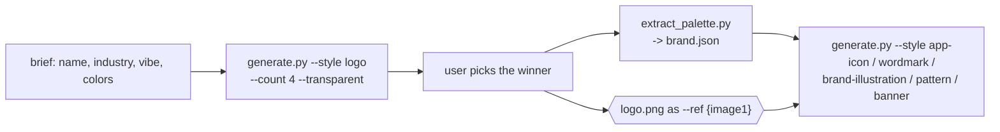

# Brand Logo Kit

Generate a **logo** and a **brand-consistent style** — a cohesive set of assets
that share the logo's shapes, palette, and feel — with Gemini image models. You
(the model) shape the brief, generate a few logo candidates, let the user pick,
derive a palette, then produce every downstream asset from that winner so the set
stays on-brand.



> **Cloud-first, with a local fallback.** By default each generation is an API
> call to Google Gemini (or OpenRouter's Gemini/Nano-Banana endpoints) — best
> quality, reference-based consistency, SynthID-watermarked. When **no API key**
> is found it automatically falls back to on-device generation via the local
> [`image-gen`](../image-gen) skill (FLUX.2 Klein on Apple Silicon) — no key, no
> cloud. The local path is **text-to-image only** (no reference image, so brand
> consistency leans on the palette + prompt wording). No key is stored in the repo.

## Prerequisites

- **Python 3.9+** (any OS). [`uv`](https://astral.sh/uv) is used if present for a
  faster install, otherwise the stdlib `venv` + `pip` are used.
- **A Gemini or OpenRouter API key** — but you usually don't set one up: it is
  auto-discovered (see [API key](#api-key-auto-discovery)).
- Dependencies installed by setup into a local venv: **google-genai**, **Pillow**,
  **numpy**, **requests**.
- **For the no-key local fallback:** an **Apple Silicon Mac** and the local
  [`image-gen`](../image-gen) skill set up (`bash ../image-gen/scripts/setup_env.sh`).
  The first local render downloads the FLUX.2 Klein weights (~8 GB, one time).

## Setup

Resolve the skill directory and run setup **once**. It creates a self-contained
venv at `~/.brand-logo-kit/.venv`, installs the deps, and prints the venv python
on its last line:

```bash
SKILL_DIR="<the folder this SKILL.md lives in>"   # e.g. .cursor/skills/brand-logo-kit
bash "$SKILL_DIR/scripts/setup_env.sh"
```

Then set the two handles every command below uses (setup prints `PY` too):

```bash
PY="$HOME/.brand-logo-kit/.venv/bin/python"
SC="$SKILL_DIR/scripts"
```

Confirm a key is available (auto-discovers + caches, prints a masked summary):

```bash
"$PY" "$SC/resolve_key.py"
```

The venv **and** the cached key live **outside the repo** under `~/.brand-logo-kit/`
so nothing sensitive is committed.

## API key auto-discovery

No key ships with this skill. `resolve_key.py` (and every generate call) searches
in this order and **caches the first hit** to `~/.brand-logo-kit/config.json`:

1. The cached config from a previous run
2. Environment variables — Google: `GEMINI_API_KEY`, `GOOGLE_API_KEY`,
   `GOOGLE_GENAI_API_KEY`, `GOOGLE_AI_API_KEY`; OpenRouter: `OPENROUTER_API_KEY`
3. `config.json` of other installed skills (e.g. `asset-generator`) under
   `~/.cursor/skills`, `~/.claude/skills`, `~/.config/skills`
4. **Local fallback** — if no key is found, the on-device `image-gen` skill
   (FLUX.2 Klein / MLX) is used, so you can still make a logo with no key at all.

The **provider** is inferred from the key prefix (`AIza…` → Google,
`sk-or-…` → OpenRouter), so the right API is used automatically. Provide a key any
time to get the higher-quality cloud path:

```bash
export GEMINI_API_KEY=AIza...           # Google AI Studio
export OPENROUTER_API_KEY=sk-or-...     # OpenRouter (Nano Banana Pro)
"$PY" "$SC/resolve_key.py" --set <YOUR_KEY>   # or cache manually
```

Force a provider on any command with `--provider google|openrouter|local`.

### Local fallback (no key)

When you have no key, or pass `--provider local`, the logo is rendered on-device
by the `image-gen` skill (default **FLUX.2 Klein**, `--model z-image-turbo` also
works). Trade-offs vs the cloud path:

- **No reference images** — it's text-to-image, so `--ref` is ignored. Keep a set
  on-brand by repeating the **palette hexes** and identical **style wording** in
  every prompt (see `brand.json`'s `prompt_snippet`).
- Weaker at **wordmark text**; best for **symbol marks / icons / patterns**.
- Apple Silicon only; first render downloads ~8 GB of weights.
- Transparent cutout still works (it renders on a flat chroma background, then
  keys it out).

## Workflow

Copy this checklist and track progress:

```
- [ ] 1. Capture the brief: name, industry, personality, color hints, mark vs wordmark
- [ ] 2. Setup: run setup_env.sh (first time) + resolve_key.py
- [ ] 3. Generate 3-4 logo candidates; show them; let the user pick
- [ ] 4. Regenerate the winner at higher resolution + clean transparent cutout
- [ ] 5. Extract the brand palette -> brand.json
- [ ] 6. Generate the brand-consistent asset set (reference the logo + palette)
- [ ] 7. Export platform sizes (favicon / app icon) and deliver
```

### Step 1: Nail the brief

Pull these from the user (or infer and state your choices): **brand name**,
**industry**, **personality** (e.g. "calm, premium, minimal"), any **color
preferences**, and whether they want a **symbol**, a **wordmark**, or both. Fold
them into the prompt text.

### Step 3: Logo candidates

Generate several transparent marks so the user can choose:

```bash
"$PY" "$SC/generate.py" \
  "a mark for 'Northwind', a calm premium sailing club: abstract wind-and-wave symbol, deep navy" \
  --style logo --transparent --count 4 -o out/northwind_logo.png
```

Show the candidates inline (read the PNGs) and let the user pick. Regenerate with a
refined prompt if none land.

### Step 4: Winner + cleanup

Regenerate the chosen direction at high resolution:

```bash
"$PY" "$SC/generate.py" "<the winning description>" \
  --style logo --transparent -r 2K -o out/logo.png
```

### Step 5: Brand palette

Derive a reusable palette from the chosen logo:

```bash
"$PY" "$SC/extract_palette.py" out/logo.png --name "Northwind" -o out/brand.json
```

`brand.json` holds the palette, role colors (primary / accent / ink / paper), and a
ready `prompt_snippet` to paste into later prompts for consistency.

### Step 6: Brand-consistent assets

Pass the logo as a **reference** (`--ref`, referenced as `{image1}`) and mention the
palette so every asset inherits the logo's DNA:

```bash
# Wordmark lockup (spell the name exactly)
"$PY" "$SC/generate.py" "wordmark lockup for 'Northwind' beside the mark {image1}, palette #0B2A4A #2E8BC0" \
  --ref out/logo.png --style logo-wordmark --transparent -o out/wordmark.png

# App icon from the mark
"$PY" "$SC/generate.py" "app icon using the mark {image1} on a deep navy background" \
  --ref out/logo.png --style app-icon -o out/app_icon.png

# On-brand spot illustration matching the logo
"$PY" "$SC/generate.py" "a sailboat spot illustration in the same style and palette as {image1}" \
  --ref out/logo.png --style brand-illustration -o out/illus_boat.png

# Seamless pattern + a social banner with room for a headline
"$PY" "$SC/generate.py" "seamless pattern from simplified motifs of {image1}, navy on off-white" \
  --ref out/logo.png --style brand-pattern -o out/pattern.png
"$PY" "$SC/generate.py" "brand banner in the style of {image1}, wind-and-wave motif, space for a headline on the left" \
  --ref out/logo.png --style brand-banner -ar 16:9 -o out/banner.png
```

For a consistent **icon set** or **illustration set**, reuse the same reference and
identical style wording across every call.

### Step 7: Export sizes + deliver

Export square sizes for favicons / app icons in one call, then embed/link the files:

```bash
"$PY" "$SC/generate.py" "app icon using the mark {image1} on deep navy" --ref out/logo.png \
  --style app-icon -o out/app_icon.png --sizes 16,32,180,512,1024
```

## Style presets

| Preset | Best for | Ratio | Transparent |
|--------|----------|-------|-------------|
| `logo` | Primary symbol mark | 1:1 | Recommended |
| `logo-wordmark` | Brand name lockup | 3:2 | Recommended |
| `monogram` | Initials lettermark | 1:1 | Recommended |
| `app-icon` | Rounded app icon | 1:1 | No |
| `favicon` | 16px-legible mark | 1:1 | Recommended |
| `social-avatar` | Circular profile pic | 1:1 | No |
| `brand-illustration` | On-brand spot illustration | 1:1 | No |
| `brand-pattern` | Seamless background pattern | 1:1 | No |
| `brand-banner` | Social/hero banner | 16:9 | No |
| `brand-photo` | On-brand photography | 16:9 | No |
| `brand-icon` | UI icon in brand style | 1:1 | Recommended |

List them any time: `"$PY" "$SC/generate.py" --list-styles`.

## Key options (generate.py)

| Option | Short | Purpose |
|--------|-------|---------|
| `--style STYLE` | `-s` | Brand preset (default `logo`) |
| `--transparent` | `-t` | Transparent-background PNG (chroma-key cutout) |
| `--ref PATH` | | Reference image (repeatable). Use `{image1}`..`{imageN}` in the prompt |
| `--count N` | `-n` | Number of variations (1-4) |
| `--aspect-ratio AR` | `-ar` | `1:1`, `3:2`, `2:3`, `16:9`, `9:16`, `4:3`, `3:4`, `4:5`, `5:4`, `21:9` |
| `--resolution RES` | `-r` | `1K` (default), `2K`, `4K` |
| `--format FMT` | `-f` | `png` (default), `webp`, `jpeg` |
| `--sizes LIST` | | Also export square sizes, e.g. `16,32,180,512` |
| `--provider P` | | Force `google`, `openrouter`, or `local` (on-device, no key) |
| `--model NAME` | | Override the model (local: `flux2-klein-4b` or `z-image-turbo`) |
| `--output PATH` | `-o` | Output file path |

## Consistency tips

- **Always reference the winning logo** (`--ref logo.png` + `{image1}`) for every
  downstream asset so shapes and construction carry over.
- **Repeat the palette** (from `brand.json`'s `prompt_snippet`) in each prompt.
- **Keep style wording identical** across a set so illustrations/icons match.
- Generate a set with `--count` and pick the most on-brand result.

## Safety

- **Disclose AI-generated imagery** where the platform or context calls for it;
  Gemini outputs carry an invisible SynthID watermark.
- **Trademark check the final logo** before commercial use — a generator can
  coincidentally reproduce an existing mark. Verify originality and don't imitate
  a known brand's identity.
- **Your prompts and reference images are sent to the API provider** (Google or
  OpenRouter). Don't include anything confidential you wouldn't upload.
- **The API key never enters the repo** — it is cached under `~/.brand-logo-kit/`,
  which is git-ignored.

## Anti-patterns

- Shipping the first logo take — generate `--count 3-4` and let the user choose.
- Generating each brand asset independently — always pass the winner as `--ref` so
  the set stays cohesive.
- Baking a key into `config.json` in the repo — it belongs in the env or the
  git-ignored `~/.brand-logo-kit/config.json` cache.
- Rendering tiny favicons directly from a detailed mark — use the `favicon` style
  (radically simplified) or `--sizes` to downscale a clean master.

## Resources

- Provider details, model slugs, key-resolution internals, prompt formula, and
  troubleshooting: [REFERENCE.md](REFERENCE.md)
