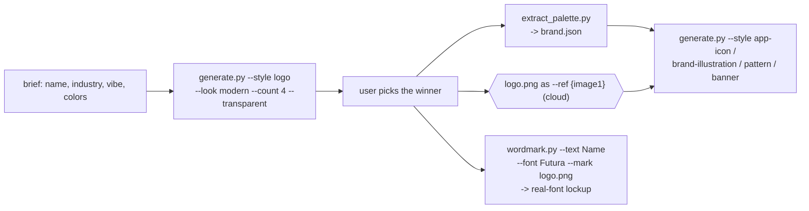

# Brand Logo Kit

Generate a **logo** and a **brand-consistent style** — a cohesive set of assets
that share the logo's shapes, palette, and feel — with Gemini image models. You
(the model) shape the brief, generate a few logo candidates, let the user pick,
derive a palette, then produce every downstream asset from that winner so the set
stays on-brand.



> **Local-first, with a cloud fallback.** This repo is local-first, so by default
> each generation runs **on-device** via the [`image-gen`](../image-gen) skill
> (**FLUX.2 Klein**, MLX) — no key, no cloud. Local is chosen automatically when
> it can realistically run: an **Apple Silicon** Mac with `image-gen` set up, and
> either the weights already downloaded **or** enough free disk to fetch them
> (~12 GB, one time). When local isn't usable, it falls back to a **cloud** API
> (Google Gemini / OpenRouter's Nano Banana Pro) — best quality, reference-based
> consistency, SynthID-watermarked. Set `BRAND_LOGO_KIT_PREFER=cloud` to try a key
> first. No key is ever stored in the repo.
>
> Two things make logos look intentional rather than generic: **`--look` presets**
> nudge the finish (e.g. `modern`, `gradient`, `glow`, `flow`, `minimal`), and
> **`wordmark.py`** sets the brand name in a **real high-quality font** (Futura,
> Avenir Next, Gill Sans, DIN…) instead of relying on the model to draw text — so
> wordmarks are crisp, correctly spelled, and deterministic.

## Prerequisites

- **Python 3.9+** (any OS). [`uv`](https://astral.sh/uv) is used if present for a
  faster install, otherwise the stdlib `venv` + `pip` are used.
- Dependencies installed by setup into a local venv: **google-genai**, **Pillow**,
  **numpy**, **requests**.
- **For the preferred local path:** an **Apple Silicon Mac** and the local
  [`image-gen`](../image-gen) skill set up (`bash ../image-gen/scripts/setup_env.sh`).
  The first local render downloads the FLUX.2 Klein weights (~12 GB free needed,
  one time). If disk is tight, either free space or provide a key.
- **For the cloud fallback:** a **Gemini or OpenRouter API key** — you usually
  don't set one up, it is auto-discovered (see [providers](#providers--key-auto-discovery)).
- **For `wordmark.py`:** real fonts already on the machine (macOS ships Futura,
  Avenir Next, Gill Sans, DIN, Optima, Didot…). No extra install; `--list-fonts`
  shows what's available, or pass any `.ttf`/`.otf` path.

## Setup

Resolve the skill directory and run setup **once**. It creates a self-contained
venv at `~/.brand-logo-kit/.venv`, installs the deps, and prints the venv python
on its last line:

```bash
SKILL_DIR="<the folder this SKILL.md lives in>"   # e.g. .cursor/skills/brand-logo-kit
bash "$SKILL_DIR/scripts/setup_env.sh"
```

Then set the two handles every command below uses (setup prints `PY` too):

```bash
PY="$HOME/.brand-logo-kit/.venv/bin/python"
SC="$SKILL_DIR/scripts"
```

See which provider will be used (prints a masked summary; caches any key it finds):

```bash
"$PY" "$SC/resolve_key.py"            # resolve provider (local-first)
"$PY" "$SC/resolve_key.py" --status   # local diagnostics: disk, weights, usability
```

The venv **and** any cached key live **outside the repo** under `~/.brand-logo-kit/`
so nothing sensitive is committed.

## Providers & key auto-discovery

Because the repo is **local-first**, `resolve_key.py` (and every generate call)
picks a provider in this order:

1. **Local (preferred)** — the on-device `image-gen` skill (FLUX.2 Klein / MLX) is
   chosen whenever it is *usable*: Apple Silicon + `image-gen` set up, and either
   the weights are already downloaded **or** there's enough free disk (~12 GB) to
   fetch them. No key, no cloud.
2. **A cloud key** — used when local isn't usable. Discovered from, and the first
   hit cached to `~/.brand-logo-kit/config.json`:
   - the cached config from a previous run
   - env vars — Google: `GEMINI_API_KEY`, `GOOGLE_API_KEY`, `GOOGLE_GENAI_API_KEY`,
     `GOOGLE_AI_API_KEY`; OpenRouter: `OPENROUTER_API_KEY`
   - `config.json` of other installed skills (e.g. `asset-generator`) under
     `~/.cursor/skills`, `~/.claude/skills`, `~/.config/skills`
3. **Local (last resort)** — if no key is found but `image-gen` is installed, local
   is used even with low disk (the run may fail mid-download).

The **provider** is inferred from a key's prefix (`AIza…` → Google, `sk-or-…` →
OpenRouter). Env knobs:

```bash
export BRAND_LOGO_KIT_PREFER=cloud       # try a key BEFORE local
export BRAND_LOGO_KIT_MIN_DISK_GB=8      # lower the free-disk bar for auto-local
export GEMINI_API_KEY=AIza...            # Google AI Studio
export OPENROUTER_API_KEY=sk-or-...      # OpenRouter (Nano Banana Pro)
"$PY" "$SC/resolve_key.py" --set <KEY>   # cache a key manually
```

Force a provider on any command with `--provider google|openrouter|local`.

### Local path (default): trade-offs

The local model (default **FLUX.2 Klein**; `--model z-image-turbo` also works) is
**text-to-image only**, so vs the cloud path:

- **No reference images** — `--ref` is ignored. Keep a set on-brand by repeating
  the **palette hexes** and identical **style wording / `--look`** in every prompt
  (see `brand.json`'s `prompt_snippet`).
- **Don't let the model draw the brand name** — diffusion text is mushy and often
  misspelled. Generate the **symbol** here, then set the **wordmark** with
  `wordmark.py` (real font) and combine them into a lockup. See [Step 6](#step-6-wordmark--lockup-real-fonts).
- Best for **symbol marks / icons / patterns / illustrations**.
- The default `--look` for local is **`modern`** (gradient + soft glow + flowing
  curves), which tests far better than the old plain/abstract output. Override with
  `--look` (e.g. `minimal`, `geometric`, `badge`).
- Transparent cutout still works (renders on a flat chroma background, then keys it).

## Workflow

Copy this checklist and track progress:

```
- [ ] 1. Capture the brief: name, industry, personality, color hints, mark vs wordmark
- [ ] 2. Setup: run setup_env.sh (first time) + resolve_key.py (see the provider)
- [ ] 3. Generate 3-4 logo candidates (pick a --look); show them; let the user pick
- [ ] 4. Regenerate the winner at higher resolution + clean transparent cutout
- [ ] 5. Extract the brand palette -> brand.json
- [ ] 6. Set the wordmark/lockup with wordmark.py (real font) from the winner
- [ ] 7. Generate the brand-consistent asset set (palette + look; --ref on cloud)
- [ ] 8. Export platform sizes (favicon / app icon) and deliver
```

### Step 1: Nail the brief

Pull these from the user (or infer and state your choices): **brand name**,
**industry**, **personality** (e.g. "calm, premium, minimal"), any **color
preferences**, and whether they want a **symbol**, a **wordmark**, or both. Fold
them into the prompt text.

### Step 3: Logo candidates

Generate several transparent marks so the user can choose. Describe a **concrete,
recognizable symbol** (not "an abstract mark") and pick a **`--look`** for the
finish — `modern`, `gradient`, `glow`, `flow`, `minimal`, `geometric`, `badge`,
`line`, `3d`… (`--list-looks`). Local defaults to `modern`; cloud defaults to none.

```bash
"$PY" "$SC/generate.py" \
  "a mark for 'Northwind', a calm premium sailing club: a stylized wind-and-wave symbol, deep navy" \
  --style logo --look modern --transparent --count 4 -o out/northwind_logo.png
```

Show the candidates inline (read the PNGs) and let the user pick. If results feel
generic/abstract, name the symbol more concretely and/or try a different `--look`.

### Step 4: Winner + cleanup

Regenerate the chosen direction at high resolution:

```bash
"$PY" "$SC/generate.py" "<the winning description>" \
  --style logo --transparent -r 2K -o out/logo.png
```

### Step 5: Brand palette

Derive a reusable palette from the chosen logo:

```bash
"$PY" "$SC/extract_palette.py" out/logo.png --name "Northwind" -o out/brand.json
```

`brand.json` holds the palette, role colors (primary / accent / ink / paper), and a
ready `prompt_snippet` to paste into later prompts for consistency.

### Step 6: Wordmark & lockup (real fonts)

Set the brand name with **`wordmark.py`**, which renders genuine fonts (crisp,
correctly spelled, transparent) — never rely on the image model to draw the name,
especially on the local path. Optionally combine it with the winning symbol into a
lockup:

```bash
# Wordmark only, in the brand ink color from brand.json, airy uppercase tracking:
"$PY" "$SC/wordmark.py" --text "Northwind" --font Futura --case upper \
  --tracking 0.12 --brand out/brand.json -o out/wordmark.png

# Horizontal lockup: the symbol on the left, the name on the right:
"$PY" "$SC/wordmark.py" --text "Northwind" --font "Avenir Next" \
  --mark out/logo.png --layout horizontal --color "#0B2A4A" -o out/lockup.png
```

`--list-fonts` shows curated fonts on this machine; `--font` also accepts any family
substring or a `.ttf`/`.otf` path. Key options: `--case upper|lower|title`,
`--tracking <em>`, `--layout horizontal|vertical`, `--mark-scale`, `--gap`, `--bg`.

### Step 7: Brand-consistent assets

Mention the **palette** (and keep the same **`--look`**) so every asset inherits the
logo's DNA. On the **cloud** path also pass the logo as a **reference** (`--ref`,
referenced as `{image1}`); on the **local** path drop `--ref` and lean on the palette
+ look wording:

```bash
# App icon from the mark (cloud: reference the logo)
"$PY" "$SC/generate.py" "app icon using the mark {image1} on a deep navy background" \
  --ref out/logo.png --style app-icon -o out/app_icon.png

# On-brand spot illustration matching the logo
"$PY" "$SC/generate.py" "a sailboat spot illustration in the same style and palette as {image1}" \
  --ref out/logo.png --style brand-illustration -o out/illus_boat.png

# Seamless pattern + a social banner with room for a headline
"$PY" "$SC/generate.py" "seamless pattern from simplified motifs of {image1}, navy on off-white" \
  --ref out/logo.png --style brand-pattern -o out/pattern.png
"$PY" "$SC/generate.py" "brand banner in the style of {image1}, wind-and-wave motif, space for a headline on the left" \
  --ref out/logo.png --style brand-banner -ar 16:9 -o out/banner.png
```

For a consistent **icon set** or **illustration set**, reuse the same reference,
palette, `--look`, and identical style wording across every call.

### Step 8: Export sizes + deliver

Export square sizes for favicons / app icons in one call, then embed/link the files:

```bash
"$PY" "$SC/generate.py" "app icon using the mark {image1} on deep navy" --ref out/logo.png \
  --style app-icon -o out/app_icon.png --sizes 16,32,180,512,1024
```

## Style presets

| Preset | Best for | Ratio | Transparent |
|--------|----------|-------|-------------|
| `logo` | Primary symbol mark | 1:1 | Recommended |
| `logo-wordmark` | Brand name lockup | 3:2 | Recommended |
| `monogram` | Initials lettermark | 1:1 | Recommended |
| `app-icon` | Rounded app icon | 1:1 | No |
| `favicon` | 16px-legible mark | 1:1 | Recommended |
| `social-avatar` | Circular profile pic | 1:1 | No |
| `brand-illustration` | On-brand spot illustration | 1:1 | No |
| `brand-pattern` | Seamless background pattern | 1:1 | No |
| `brand-banner` | Social/hero banner | 16:9 | No |
| `brand-photo` | On-brand photography | 16:9 | No |
| `brand-icon` | UI icon in brand style | 1:1 | Recommended |

List them any time: `"$PY" "$SC/generate.py" --list-styles`.

## Looks (visual finish)

A **`--look`** appends a consistent finish to any style — steer designs away from
generic/abstract without hand-tuning the prompt. `--list-looks` prints them all:

| Look | Effect |
|------|--------|
| `auto` | Default — `modern` for local, none for cloud |
| `modern` | Gradient + soft glow + flowing curves (premium tech feel) |
| `minimal` | Flat, restrained, lots of negative space |
| `geometric` | Precise grid construction, symmetry |
| `gradient` / `glow` / `flow` | Individual modern finishes |
| `line` | Clean monoline art |
| `badge` | Vintage emblem/crest |
| `3d` / `mesh` / `duotone` / `corporate` | Depth / colorful mesh / two-tone / corporate |

Keep the **same look across a set** for cohesion.

## Key options (generate.py)

| Option | Short | Purpose |
|--------|-------|---------|
| `--style STYLE` | `-s` | Brand preset (default `logo`) |
| `--look LOOK` | `-l` | Visual finish (default `auto`); `--list-looks` |
| `--transparent` | `-t` | Transparent-background PNG (chroma-key cutout) |
| `--ref PATH` | | Reference image (repeatable, **cloud only**). Use `{image1}`..`{imageN}` |
| `--count N` | `-n` | Number of variations (1-4) |
| `--aspect-ratio AR` | `-ar` | `1:1`, `3:2`, `2:3`, `16:9`, `9:16`, `4:3`, `3:4`, `4:5`, `5:4`, `21:9` |
| `--resolution RES` | `-r` | `1K` (default), `2K`, `4K` |
| `--format FMT` | `-f` | `png` (default), `webp`, `jpeg` |
| `--sizes LIST` | | Also export square sizes, e.g. `16,32,180,512` |
| `--provider P` | | Force `local` (on-device, no key), `google`, or `openrouter` |
| `--model NAME` | | Override the model (local: `flux2-klein-4b` or `z-image-turbo`) |
| `--output PATH` | `-o` | Output file path |

## Key options (wordmark.py)

Deterministic real-font wordmark/lockup composer — use it for **all brand text**.

| Option | Purpose |
|--------|---------|
| `--text STR` (`-T`) | The name/text to set (required) |
| `--font SPEC` | Family name, substring, or `.ttf`/`.otf` path; `--list-fonts` |
| `--color HEX` / `--brand brand.json` | Ink color, or pull it from a brand.json role (`--color-role`) |
| `--case` | `upper` / `lower` / `title` / `as-is` |
| `--tracking EM` | Letter-spacing in em (e.g. `0.15`) |
| `--mark PATH` | Symbol image to build a lockup with |
| `--layout` | `horizontal` (default) or `vertical` |
| `--mark-scale` / `--gap` | Mark height vs text, and spacing (em) in a lockup |
| `--bg HEX` / `--padding N` | Background fill (default transparent) / px padding |
| `--output PATH` (`-o`) | Output PNG path |

## Consistency tips

- **Set all brand text with `wordmark.py`** (one chosen font) — never let the image
  model draw the name.
- **Repeat the palette** (from `brand.json`'s `prompt_snippet`) and keep the **same
  `--look`** in every prompt across a set.
- **On the cloud path, reference the winning logo** (`--ref logo.png` + `{image1}`)
  so shapes and construction carry over. On the **local** path (text-to-image) drop
  `--ref` and lean harder on palette + look + identical style wording.
- Generate a set with `--count` and pick the most on-brand result.

## Safety

- **Disclose AI-generated imagery** where the platform or context calls for it;
  cloud Gemini outputs carry an invisible SynthID watermark (local ones don't).
- **Trademark check the final logo** before commercial use — a generator can
  coincidentally reproduce an existing mark. Verify originality and don't imitate
  a known brand's identity.
- **The local path is fully offline.** On the **cloud** path your prompts and
  reference images are sent to the API provider (Google or OpenRouter) — don't
  include anything confidential you wouldn't upload.
- **The API key never enters the repo** — it is cached under `~/.brand-logo-kit/`,
  which is git-ignored. `wordmark.py` runs entirely locally.

## Anti-patterns

- **Letting the image model draw the brand name** — diffusion text is mushy and
  misspells; set it with `wordmark.py` (real font) instead.
- Prompting for "an abstract mark" and expecting a strong logo — name a **concrete
  symbol** and pick a `--look`; abstract wording yields generic blobs.
- Shipping the first logo take — generate `--count 3-4` and let the user choose.
- Generating each brand asset with a **different look/palette** — keep them
  identical so the set stays cohesive (and `--ref` the winner on the cloud path).
- Baking a key into `config.json` in the repo — it belongs in the env or the
  git-ignored `~/.brand-logo-kit/config.json` cache.
- Rendering tiny favicons directly from a detailed mark — use the `favicon` style
  (radically simplified) or `--sizes` to downscale a clean master.

## Resources

- Provider details, model slugs, key-resolution internals, prompt formula, and
  troubleshooting: [REFERENCE.md](REFERENCE.md)
