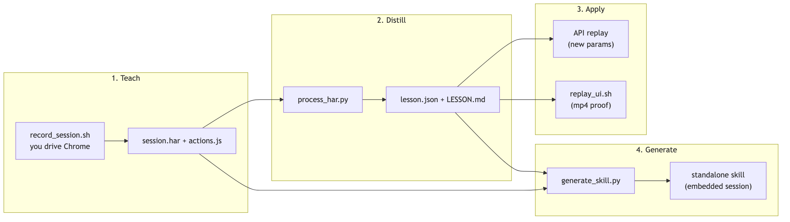

# generate-web-skills

**Teach an agent a website once, by demonstration — then get a self-contained skill that repeats that action forever, with new inputs, locally or on a server.**

Most agents re-learn a website from scratch every time: guess selectors, click around, break on the next redesign, burn tokens. This skill flips that. You perform the action once in a real Chrome window. It records what *actually* happened on the wire, distills the real API calls and the parameters you can change, and bottles the whole thing into a standalone skill that just re-issues the proven request with your new values.

Deterministic replay, not guesswork.

```bash
npx skills add puntorigen/skills@generate-web-skills -g -y
```

---

## In 30 seconds

- **Demonstrate, don't describe.** Do the task once in Chrome; the skill captures the network session (HAR) and the UI steps.
- **It learns the real calls.** It finds the endpoint that produced the result and the "knobs" you can turn (dates, search terms, ids, pagination).
- **It ships a new skill.** One command bottles that action into a self-contained skill — embedded session, replay scripts, and docs — with **no** dependency on this skill or the original recording.
- **Runs anywhere.** The generated API replay is stdlib-only Python with no browser, so it runs headless on a server or in CI. A browser-based mode exists when you want an mp4 as visual proof.
- **Shareable and multi-user.** Optionally strip the recorder's login so each teammate signs in as themselves on first run.

---

## Quickstart

You don't run the scripts by hand — you ask your agent, and it drives the phases for you. For example:

> "Teach yourself how to search flights on example-air.com, then turn it into a reusable skill called `flight-search`."

The agent will:

1. Open a real Chrome window and ask you to perform the action once.
2. Distill the recording and tell you *what it learned* (endpoints, changeable parameters).
3. Package it into a standalone skill you can call again with different inputs — e.g. "search SFO→SEA on 2026-09-02".

That's it. From then on, the new skill answers the request directly, no re-discovery.

---

## How it works

Four phases. Every phase is a script in [`scripts/`](scripts/), and the agent is the reasoning glue between them.



<!-- Diagram source: assets/pipeline.mmd — re-render with:
     npx -y @mermaid-js/mermaid-cli -i assets/pipeline.mmd -o assets/pipeline.png -b white -s 3 -->


1. **Teach** — you perform the action once in Chrome; it captures all network activity and the UI steps.
2. **Distill** — it drops noise, keeps the real XHR/fetch/document calls, and extracts the parameter knobs and auth surface.
3. **Apply** — do a variation right now: replay the API with new parameters (fast, no browser), or replay the UI and get an mp4.
4. **Generate** — bottle one action into a self-contained, shareable skill.

---

## What you get: a self-contained skill

A generated skill needs nothing from this repo to run. Everything resolves inside its own folder:

```
<skill-name>/
├── SKILL.md            # how to run this action (agent-facing)
├── REFERENCE.md        # endpoints, knobs, replay contract
├── SECURITY.md         # what's embedded + sharing rules
├── data/
│   ├── session.har     # the trimmed, flow-scoped session
│   ├── flow.json       # ordered replay steps (auth + prerequisites + result)
│   └── ...
└── scripts/
    ├── replay_api.py   # replay the flow with --set knob=value  (stdlib, no browser)
    ├── replay_ui.sh    # optional: drive the real UI -> mp4 proof
    └── ...
```

Call it with your own inputs:

```bash
python3 scripts/replay_api.py --set from=SFO --set to=SEA --set date=2026-09-02
```

It re-issues the exact recorded request chain, swapping only your knobs, and prints the result.

---

## Local or on a server

This is the part that makes it genuinely useful in production:

| Mode | Needs a browser? | Good for |
|------|------------------|----------|
| **API replay** (`replay_api.py`) | No — stdlib Python only | Servers, CI, cron, background jobs, high volume |
| **UI replay** (`replay_ui.sh`) | Yes — Chrome + ffmpeg | Visual proof (mp4), JS-heavy apps that are hard to call directly |

Because API replay has zero runtime dependencies beyond Python, a generated skill drops straight into a headless environment. No Playwright, no browser, no agent loop at request time — just the proven HTTP call with your parameters.

---

## Two worked examples

**1. A read-only data action (browserless):** teach it a flight/price/listing search, then query it forever.

```bash
python3 scripts/replay_api.py --set from=LAX --set to=JFK --set date=2026-08-14
```

Read-style calls run autonomously — perfect for a server.

**2. A stateful, multi-account action:** teach it to create a Linear issue, then let each teammate run it as themselves.

Generate with per-user login enabled:

```bash
# see which logins the action touches (names/hosts only — never values)
python3 scripts/generate_skill.py "$LESSON_DIR" --list-auth-accounts

# ship it without your credentials; each user logs in on first run
python3 scripts/generate_skill.py "$LESSON_DIR" --name linear-create-issue --with-setup
```

State-changing steps (create/update/delete) never fire without explicit confirmation (`--confirm-mutating`).

---

## Multi-user by design

By default a generated skill embeds the recorder's own login. With `--with-setup`, the chosen hosts' credentials are **stripped** from the shipped session and replaced with placeholders. Each installer runs a one-time setup:

```bash
bash scripts/setup.sh
```

A browser opens per service, they log in, and their session is saved locally to `data/user-auth.<host>.har` (gitignored, never leaves their machine). Replay overlays that per host — and refuses to run a setup host until its login is captured. Narrow it with `--setup-hosts a.com,b.com` if only some services should be per-user.

---

## Safe by default

- **Secret scan gate.** Before packaging, the session is scanned for embedded secrets. Names and locations are reported — **never values**. Critical material (payment cards, plaintext passwords, private keys) blocks generation until you explicitly acknowledge.
- **Redaction.** Distilled lessons keep credential *names* so replay knows what's required, but redact the *values*. Cookies and tokens are read from files at call time and never printed to chat or logs.
- **Mutation guardrails.** Booking/purchase/delete-style steps are refused unless confirmed after user approval.
- **It doesn't bypass auth.** It reuses the session you established; it doesn't harvest credentials or defeat login.

---

## Requirements

- **Node.js + npx** — Playwright codegen (recording) and the UI replay runner.
- **Google Chrome** — the recording browser (`PW_CHANNEL=chromium` uses Playwright's bundled browser instead).
- **python3** — the HAR distiller and API replay (stdlib only, no pip installs).
- **ffmpeg** — only for UI replay (webm → mp4 proof).

First run installs the `playwright` npm package into `scripts/node_modules` automatically. Generated API-replay-only skills need just **python3**.

---

## When to use it

**Great for:** repetitive web actions with a stable underlying request — searches, lookups, form submissions, dashboard queries, internal tools without a public API. Especially when you want that action to run unattended on a server.

**Not for:** one-off tasks you'll never repeat, or flows behind hard bot-protection you're not permitted to automate. Sessions expire — when replay starts returning 401/403, just re-record and regenerate.

---

## FAQ

**Does the agent figure out the website each time?** No. That happens once, during teaching. After that it replays the recorded call with your new inputs.

**What if the session expires?** Re-record the action and regenerate the skill. The generated `SECURITY.md` explains rotation and sharing.

**Can I share a generated skill?** Yes. If it embeds your login, share it only with people you'd trust with that account — or generate it `--with-setup` so no login ships and each user authenticates themselves.

**Does it store my passwords?** No. It captures the resulting session (cookies/tokens), not your credentials, and redacts values everywhere except the session file itself.

---

## Learn more

- [SKILL.md](SKILL.md) — the full agent-facing workflow and phase-by-phase instructions.
- [REFERENCE.md](REFERENCE.md) — schemas, the replay contract, secret-scan levels, and the per-user setup internals.
