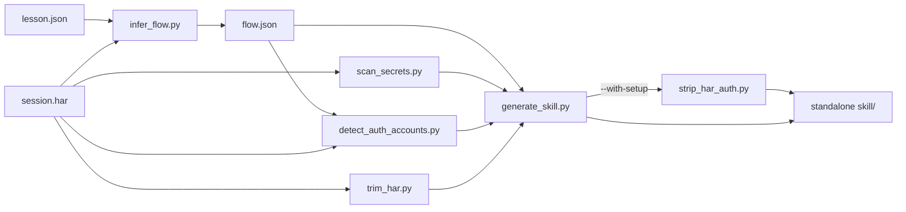

# Generate Web Skills — Reference

Background for [SKILL.md](SKILL.md): the artifacts each phase writes, the HAR
shape, how `process_har.py` decides what to keep, how parameter knobs and the
auth surface are detected, the `lesson.json` schema, the UI-replay contract,
and video conversion.

## Lesson directory layout

Everything for one lesson lives under `~/.web-lessons/<host>/<lesson-name>/`
(override the root with `LESSONS_ROOT`). Nothing here belongs in a git repo.

```
~/.web-lessons/
├── .browser-profile/            # persistent Chrome profile (logins persist)
└── www.example-air.com/
    └── flight-availability/
        ├── meta.json            # lesson name, start URL, host, channel, time
        ├── session.har          # all captured network activity (Phase 1)
        ├── actions.js           # recorded UI steps, --target javascript (Phase 1)
        ├── lesson.json          # distilled endpoints/knobs/auth (Phase 2)
        ├── LESSON.md            # human-readable distillation (Phase 2)
        ├── flow.json            # primary action + prerequisite chain (Phase 4)
        ├── variant.js           # your adapted flow for UI replay (Phase 3, you write)
        └── runs/<timestamp>/
            ├── video/*.webm     # raw Playwright recording
            └── proof.mp4        # converted proof (Phase 3)
```

## Phase 1 internals (recording)

`record_session.sh` runs:

```bash
npx playwright codegen \
  --save-har="$LESSON_DIR/session.har" \
  --user-data-dir="$LESSONS_ROOT/.browser-profile" \
  --target=javascript \
  -o "$LESSON_DIR/actions.js" \
  [--channel=chrome] [--save-har-glob='**/api/**'] \
  "$START_URL"
```

- **`--user-data-dir`** gives a persistent, dedicated profile. Chrome 136+
  refuses to let automation attach to the *default* profile, so a separate one
  is mandatory; the upside is that a login done once during teaching is reused
  on the next recording and on UI replay.
- **`--save-har`** records every request/response (headers, cookies, bodies,
  timings) as a HAR (a JSON schema). `--save-har-glob` (via `SAVE_HAR_GLOB`)
  narrows capture to matching URLs, e.g. only `**/api/**`.
- **`--target=javascript`** makes `actions.js` a plain runnable script (not a
  `@playwright/test` file), so the UI steps are easy to lift into `variant.js`.
- The HAR is flushed when the user **closes the browser** — always wait.

## HAR anatomy

The parser cares about `log.entries[]`, each roughly:

```json
{
  "startedDateTime": "2026-07-01T18:00:00.000Z",
  "time": 123.4,
  "_resourceType": "xhr",
  "request": {
    "method": "GET",
    "url": "https://host/api/search?from=LAX&to=JFK&date=2026-08-14",
    "headers": [{ "name": "Authorization", "value": "Bearer ..." }],
    "queryString": [{ "name": "from", "value": "LAX" }],
    "cookies": [{ "name": "session", "value": "..." }],
    "postData": { "mimeType": "application/json", "text": "{...}" }
  },
  "response": {
    "status": 200,
    "content": { "mimeType": "application/json", "size": 812, "text": "{...}",
                 "encoding": "base64" }
  }
}
```

`_resourceType` is Playwright's classification (`xhr`, `fetch`, `document`,
`script`, `image`, ...). `response.content.text` may be base64 (`encoding`) or
omitted for large/binary bodies.

## What `process_har.py` keeps vs. drops

Goal: surface the **API calls that carry the action**, not page chrome.

Dropped:
- **Noise hosts** — analytics/telemetry/ads (Google Analytics/GTM, Segment,
  Sentry, Datadog, New Relic, FullStory, Hotjar, Mixpanel, Amplitude,
  Intercom, LaunchDarkly, Clarity, ...). Matched by substring in `NOISE_HOSTS`.
- **Static assets** — by `_resourceType` (`stylesheet`, `script`, `image`,
  `font`, `media`, `manifest`, `websocket`, ...), by file extension, or by
  response mime (`image/*`, `font/*`, css, js).

Kept: `xhr`, `fetch`, and `document` requests to non-noise hosts. Entries are
grouped into **endpoints** by `METHOD host path-template`.

### Path templating

To group `/api/orders/123` and `/api/orders/456` together, each path segment
that looks like an id is replaced with `{id}`: integers, UUIDs, and long hex
strings (≥16 chars). So both become `GET host/api/orders/{id}`.

### Endpoint ordering

Endpoints are sorted so the useful ones surface first: non-mutating before
mutating, then more parameter candidates, then higher call count. The
data-bearing search/availability call therefore tends to rank at the top.

## Parameter-knob detection

A knob is a value the agent can change to make a variation. For every query
param and every scalar in a JSON request body (flattened to dotted paths), a
candidate is recorded when **either**:

- the **value** matches a pattern:
  - `date` — `YYYY-MM-DD[THH:MM]` or `D/M/Y`
  - `code` — three uppercase letters (IATA airport, currency, state)
  - `uuid` — canonical UUID
  - `number` — integer or decimal
- or the **name** matches a knob pattern (`KNOB_NAME_RE`): dates, from/to,
  origin/dest, depart/arrive/return, check-in/out, city/airport/station,
  lat/lon, page/offset/limit/cursor/size, sort/order, q/query/search/term,
  filter/category/type/status, id/code/currency, passengers/adults/children,
  qty/amount/price/min/max.

Each candidate records `location` (`query` | `body`), `name` (param or dotted
body path), `kind`, and a redacted `sample`. These are exactly the fields to
substitute for an API-replay variation.

## Auth surface and redaction

Credential **values are never copied** into `lesson.json` / `LESSON.md`:

- Header names in `AUTH_HEADER_NAMES` (authorization, x-api-key, x-auth-token,
  x-csrf-token, ...) are kept as names; the value becomes `"<scheme> <redacted>"`
  (e.g. `Bearer <redacted>`).
- Any field whose **name** matches `SECRET_KEY_RE` (password, token, secret,
  api_key, refresh, client_secret, signature, csrf, otp, card, cvv, ...) is
  replaced with `<redacted>` in bodies, query samples, and examples.
- Cookie **names** are collected (from `request.cookies[]` and the `Cookie`
  header) into the auth surface; cookie values are never stored.

`lesson.json`/`LESSON.md` therefore tell you *what a replay needs* without
leaking the credentials. The live values remain only in `session.har` and the
browser profile — read them from there at call time, never print them.

## `lesson.json` schema

```json
{
  "lesson": "flight-availability",
  "source_url": "https://www.example-air.com",
  "host": "www.example-air.com",
  "recorded_at": "2026-07-01T18:00:00Z",
  "counts": { "total_requests": 214, "kept": 9, "endpoints": 4 },
  "auth_surface": {
    "cookies_seen": ["session", "csrftoken"],
    "auth_headers_seen": ["authorization"]
  },
  "endpoints": [
    {
      "id": "GET www.example-air.com/api/search",
      "action_guess": "search search",
      "method": "GET",
      "host": "www.example-air.com",
      "path_template": "/api/search",
      "count": 2,
      "mutating": false,
      "param_candidates": [
        { "location": "query", "name": "from", "kind": "code", "sample": "LAX" },
        { "location": "query", "name": "to", "kind": "code", "sample": "JFK" },
        { "location": "query", "name": "date", "kind": "date", "sample": "2026-08-14" }
      ],
      "auth": { "cookies_required": ["session"], "headers": ["authorization"] },
      "examples": [
        {
          "url": "https://.../api/search?from=LAX&to=JFK&date=2026-08-14",
          "query": { "from": "LAX", "to": "JFK", "date": "2026-08-14" },
          "started": "2026-07-01T18:00:03Z",
          "request_headers": { "accept": "application/json" },
          "response": {
            "status": 200, "mime": "application/json", "size": 812,
            "json_keys": ["flights", "currency"],
            "json_sample": "{\"flights\":[...]}"
          }
        }
      ]
    }
  ]
}
```

`mutating` is `true` for POST/PUT/PATCH/DELETE — the replay-confirmation gate.
`examples` is capped (`--max-examples`, default 3) and response bodies are
truncated (`--body-chars`, default 1200).

## API-replay recipe

1. Read `lesson.json`; pick the endpoint whose response held the data.
2. Choose the `param_candidates` to change (new date, new origin/destination).
3. Read the matching cookies/auth headers from `session.har` for that host **at
   call time** — do not print them.
4. Issue the request with `curl` or python `requests`, substituting params.
5. Parse the response and answer the user.

Only do this autonomously for idempotent reads (GET/search). For `mutating`
endpoints, confirm with the user first.

## UI-replay contract and video

`variant.js` exports one async function; the runner supplies `page`:

```js
module.exports = async (page) => {
  await page.goto("https://www.example-air.com");
  await page.getByLabel("From").fill("SFO");
  await page.getByRole("button", { name: "Search" }).click();
  await page.waitForSelector(".results");
};
```

`run_variant.js` calls `chromium.launchPersistentContext(profile, {
recordVideo: { dir } })` (reusing the teaching profile, so logins persist),
runs the function, and closes the context — which **flushes the `.webm`**.
Env: `PW_CHANNEL` (default `chrome`; `""` = bundled chromium), `PW_PROFILE`,
`PW_HEADLESS=1`, `PW_TIMEOUT` (ms).

`replay_ui.sh` then converts to mp4:

```bash
ffmpeg -y -i video/*.webm -movflags +faststart -pix_fmt yuv420p proof.mp4
```

`-pix_fmt yuv420p` keeps the mp4 broadly playable; `+faststart` moves the moov
atom to the front for streaming. Multiple `.webm` segments (multi-page flows)
are concatenated in filename order. Feed `proof.mp4` to the **review-mp4** skill
to describe/verify the flow.

## Phase 4 — Generating a standalone skill

Phase 4 packages one action into a self-contained skill. The scripts share HAR
parsing/redaction via `scripts/har_lib.py` (extracted from `process_har.py`, so
both use identical keep-filters, endpoint grouping, and redaction).

Pipeline:



### `flow.json` schema (`infer_flow.py`)

The ordered chain needed to perform the primary action, prerequisites included.

```json
{
  "primary_endpoint_id": "GET www.example-air.com/api/search",
  "action_label": "search",
  "host": "www.example-air.com",
  "source_url": "https://www.example-air.com",
  "primary_param_candidates": [
    { "location": "query", "name": "from", "kind": "code", "sample": "LAX" }
  ],
  "mutating_steps": [2],
  "api_steps": [
    {
      "step": 1, "har_entry_index": 0,
      "endpoint_id": "GET www.example-air.com/",
      "method": "GET", "host": "www.example-air.com",
      "path_template": "/", "role": "prerequisite", "mutating": false,
      "started": "2026-07-01T18:00:00Z", "param_summary": {}
    }
  ],
  "has_ui": true,
  "ui_steps": ["await page.goto('https://www.example-air.com/')", "..."],
  "auth_surface": { "cookies_seen": ["session"], "auth_headers_seen": ["authorization"] }
}
```

- **Primary selection:** the top-ranked non-mutating, data-bearing endpoint in
  `lesson.json` (endpoints there are already sorted). Override with
  `--endpoint "METHOD host/path"`.
- **Prerequisite chain:** every *kept* HAR entry from session start through the
  primary endpoint's **last** call becomes a step (auth warm-up, CSRF,
  autocomplete, the data call). Roles are `primary` / `prerequisite`.
- **`har_entry_index`** points into the HAR. `trim_har.py` re-indexes these to
  match the trimmed `data/session.har`, so the embedded pair stays consistent.
- **Setup fields (`--with-setup` only):** `generate_skill.py` adds
  `requires_setup: true` and `setup_hosts: [...]` to the embedded `flow.json`;
  replay uses them to overlay each user's own login and to gate on missing setup.

### Generated skill layout

```
<skill-name>/
├── SKILL.md            # drafted triggers + workflow
├── REFERENCE.md        # endpoints, knobs, step sequence, replay contract
├── SECURITY.md         # credential warning + secret scan + sharing rules
├── .gitignore          # keeps runs/, profiles, node_modules, user-auth.*.har out
├── data/
│   ├── session.har     # flow-scoped, re-indexed (live cookies/headers/bodies)
│   ├── flow.json       # re-indexed ordered steps
│   ├── lesson.json     # redacted distillation (copy)
│   ├── actions.js      # recorded UI steps (if any)
│   ├── auth_accounts.json  # (--with-setup) detected accounts + setup flags
│   └── meta.json
└── scripts/
    ├── replay_api.py       # replay the flow with --set knob=value
    ├── har_auth.py         # extract/overlay session cookies + AuthOverlay
    ├── replay_ui.sh        # UI replay -> mp4 (skill-local profile)
    ├── run_variant.js      # Playwright runner (injects HAR cookies)
    ├── variant.js          # editable UI scaffold (recorded steps)
    ├── setup.sh            # (--with-setup) capture each user's own login(s)
    ├── setup_login.js      # (--with-setup) per-host login capture
    └── package.json        # playwright dep
```

`setup.sh` / `setup_login.js` and `data/auth_accounts.json` ship only when the
skill was generated `--with-setup`. Each user's captured login is written to
`data/user-auth.<host>.har` at setup time (gitignored, never committed).

Nothing references `~/.web-lessons` or `generate-web-skills`; the skill is
independent. `generate_skill.py --format` chooses the default output path
(`cursor-personal` / `cursor-project` / `skills-sh`); `--output` overrides it.
By default the skill is auto-invocable; `--explicit-only` sets
`disable-model-invocation: true`.

### Secret scan (`scan_secrets.py`)

Reports names/locations only — **never values**. Severities:

| Severity | What | Effect |
|---|---|---|
| info | auth headers, cookie names (expected for replay) | listed in `SECURITY.md` |
| warning | fields whose *name* looks secret; long high-entropy tokens | listed |
| critical | Luhn-valid card numbers, plaintext password/CVV/SSN fields, private-key PEM | `generate_skill.py` **aborts** unless `--allow-critical` |

Detection covers request query/headers/body and response bodies. Card numbers
are only flagged when Luhn-valid to avoid false positives. `--allow-critical`
is the acknowledgment gate: pass it only after warning the user.

### Sequence API replay (`replay_api.py`)

Self-contained (stdlib + sibling `har_auth.py`). Reads `data/flow.json` +
`data/session.har`, reissues every `api_step` in order, and prints the primary
step's response.

- Substitute knobs with `--set NAME=VALUE` (matched against query params and
  JSON body scalars by name / dotted path) or `--params-json '{...}'`. A knob is
  applied to **every** step that has it, so a shared value (e.g. `from`) updates
  both an autocomplete prerequisite and the search call.
- Cookies/auth come from each entry's recorded headers at call time (via
  `har_auth.cookie_header_for_entry`); values are never printed.
- `--only-primary` runs just the primary call (skip prerequisites when the
  embedded session is still valid).
- Mutating steps are **refused** unless `--confirm-mutating`. `accept-encoding`
  is stripped so responses arrive uncompressed; gzip/deflate are still decoded
  defensively.

### Cookie-injection UI replay

Unlike Phase 3 (which reuses the teaching profile), a generated skill has no
`~/.web-lessons` profile. `replay_ui.sh` runs `har_auth.py` to export the HAR's
cookies as Playwright cookie objects, and `run_variant.js` launches a
**skill-local** persistent profile (`<skill>/.browser-profile`), calls
`context.addCookies(...)`, then runs `variant.js`. The variant signature adds a
`params` argument (from the `PW_PARAMS` env var):

```js
module.exports = async (page, params = {}) => { await page.goto("..."); ... };
```

Video → mp4 conversion is identical to Phase 3.

### Per-user setup (multi-account) — `--with-setup`

By default a generated skill embeds the recorder's own login. `--with-setup`
makes each installer supply **their own** login for one or more services, so the
same skill works per-account (e.g. each user's own Linear).

**Detection (`detect_auth_accounts.py`).** Walks the flow's `api_steps` and
lists every host that carries auth material — request cookies, `Set-Cookie`
responses, or auth headers (`har_lib.AUTH_HEADER_NAMES`). One account per host,
with `host`, `label`, `login_url` (the recorded `source_url` for the primary
host, else `https://<host>/`), `cookie_names`, `auth_header_names`,
`seen_in_steps`, and `is_primary`. Names/hosts only — never values.
`generate_skill.py --list-auth-accounts` prints this as JSON so you can **ask
the user** which accounts to set up before generating.

**Selection + strip.** `--with-setup` (optionally narrowed by
`--setup-hosts a,b`) resolves the setup host set, then `strip_har_auth.py`
replaces those hosts' cookie/auth-header/`Set-Cookie` **values** with
`<setup-required>` placeholders in the shipped `data/session.har` (URLs, query
knobs, and bodies stay intact). Hosts left out keep the recorder's embedded
login. `flow.json` gains `requires_setup: true` + `setup_hosts`, and
`data/auth_accounts.json` records every account with a `setup_required` flag.

**Capture (`setup.sh` → `setup_login.js`).** `setup.sh` reads
`auth_accounts.json`, and for each `setup_required` host opens a headed browser
(persistent profile under `<skill>/.setup-profile/<host>`) at its `login_url`.
The user logs in and presses Enter; the script reads the live context cookies
(plus any auth headers seen on requests to that host) and writes a minimal HAR
to `data/user-auth.<host>.har`. Values are only written to disk, never printed.

**Overlay + gating (`har_auth.py`).** `AuthOverlay(setup_hosts, data_dir)` loads
each `user-auth.<host>.har` (`user_har_path()` derives the filename from a host
slug). At replay:

- **API** (`replay_api.py`): for a request whose host is a setup host, the
  `Cookie` header and auth headers are taken from the user's capture instead of
  the (stripped) shipped values; any placeholder that the user didn't capture is
  dropped rather than sent. If `requires_setup` and a needed host has no capture,
  replay aborts telling the user to run `setup.sh` (bypass: `--skip-setup-check`).
- **UI** (`replay_ui.sh`): a `har_auth.py --check-setup` gate blocks replay until
  captures exist, then cookies are exported with `--overlay-setup` (setup hosts'
  shipped cookies dropped, the user's substituted in).

## Troubleshooting

| Symptom | Cause / fix |
|---|---|
| `codegen` errors about the browser channel | System Chrome missing. Set `PW_CHANNEL=chromium` (bundled) or install Chrome. |
| Nothing captured / empty HAR | Browser closed before any request, or `SAVE_HAR_GLOB` too narrow. |
| `lesson.json` has 0 endpoints | The action used only static/websocket traffic, or all hosts were noise-filtered. Re-record; inspect `session.har`. Consider removing a `SAVE_HAR_GLOB`. |
| The data call isn't listed | It may be a `document` navigation or on a filtered host; check `session.har` directly for the URL that returned the result. |
| UI replay records no video | The variant never opened/navigated a page, or it threw before `goto`. Check the runner's stderr. |
| Replay times out on a selector | Selectors from `actions.js` may be brittle; prefer role/label locators and add `waitForSelector`. |
| Chrome profile "already in use" | A codegen/replay session is still open on the same profile. Close it first. |
| `generate_skill.py` refuses (CRITICAL secrets) | Card/password/SSN/private-key material in the HAR. Warn the user (names/locations only), then pass `--allow-critical`, or re-record without entering that data. |
| Wrong primary action packaged | Pass `--endpoint "METHOD host/path"` (or `--label`) to `generate_skill.py` / `infer_flow.py`, or hand-edit `data/flow.json`. |
| Generated skill replay returns 401/403 | The embedded session expired. Re-record with `generate-web-skills` and regenerate the skill. |
| `infer_flow.py`: "primary endpoint not found in session.har" | `lesson.json` is stale. Re-run `process_har.py`, then `infer_flow.py`. |
| `--with-setup` errors "no auth accounts were detected" | The flow has no logged-in host (anonymous action). Generate without `--with-setup`. |
| Setup-skill replay says "setup required" | The user hasn't captured a login yet. Run `bash scripts/setup.sh` (or `--skip-setup-check` to use only the shipped session). |
| `setup_login.js` warns it captured nothing | Login wasn't finished before pressing Enter, or the site sets no readable cookies. Re-run `setup.sh` and complete login first. |
| Setup-skill replay still 401s a setup host | The user's captured session expired or the host needs an auth header that wasn't seen during setup. Re-run `setup.sh`, interacting with the app so the request fires. |
