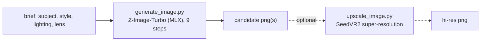

# Image Generation

Generate hyper-realistic images from a text prompt, fully offline. A thin wrapper
drives **mflux** (a native-MLX port of modern image models); **you** (the model)
shape the brief into a strong prompt, generate a couple of candidates, let the
user pick, and optionally upscale the winner for hi-res.

This is the programmatic, local equivalent of an app like Draw Things: local
model weights, a scriptable Python API, no GUI and no cloud.



Pairs with **voice-clone-narration** and **bg-music** to produce full reel assets
(visuals + voiceover + music) entirely on-device.

Everything lives **outside the repo** at `~/.image-gen/` (the venv and generated
images). Model weights land in the shared Hugging Face cache
(`~/.cache/huggingface`), never in the repo.

## Prerequisites

- **Apple Silicon Mac** (M1-M4). mflux runs the models on the Apple GPU via MLX;
  there is no CPU/CUDA fallback in this skill. 16 GB unified memory is enough for
  the default Z-Image-Turbo 4-bit engine.
- **uv** (package manager). Setup installs mflux into an isolated venv. If missing:
  `curl -LsSf https://astral.sh/uv/install.sh | sh`.
- **~6 GB free disk** for the default model (downloaded once from Hugging Face,
  anonymously - no token). More if you also pull FLUX.2 (~15 GB) or SeedVR2 (~8 GB).
- Internet on first run only (to fetch weights). Generation is offline.
- No ffmpeg needed - images are written directly as PNG.

## Setup

Resolve the skill directory and run setup once (creates the venv and installs
mflux - the first run downloads Python dependencies):

```bash
SKILL_DIR="<the folder this SKILL.md lives in>"   # e.g. .cursor/skills/image-gen
bash "$SKILL_DIR/scripts/setup_env.sh"
```

Then set the handle used by the scripts (setup prints it too):

```bash
IMG_HOME="${IMAGE_GEN_HOME:-$HOME/.image-gen}"
PY="$IMG_HOME/.venv/bin/python"
```

## Workflow

Copy this checklist and track progress:

```
- [ ] 1. Confirm the brief: subject, style, lighting, lens/mood, resolution/aspect
- [ ] 2. Setup: run setup_env.sh (first time only)
- [ ] 3. Write a concrete prompt; generate 2 candidates
- [ ] 4. Show/link the candidates; let the user pick (regenerate if needed)
- [ ] 5. (optional) Upscale the winner for hi-res
- [ ] 6. Deliver the image(s)
```

### Step 1: Nail the brief

Image quality is mostly prompt quality. Pull these from the user (or infer and
state your choices):

- **Subject**: who/what is in frame, doing what.
- **Style**: photorealistic / editorial photo / cinematic still / product shot / illustration.
- **Lighting**: golden hour, soft window light, studio softbox, neon, overcast.
- **Lens / framing**: close-up portrait, wide 24mm landscape, 85mm f/1.4 bokeh, top-down.
- **Resolution / aspect**: e.g. 1024x1024 (square), 1280x720 (16:9), 832x1216 (portrait).

### Step 3: Generate

```bash
"$PY" "$SKILL_DIR/scripts/generate_image.py" \
  --prompt "hyper-realistic editorial photo of a woman laughing, soft golden-hour backlight, 85mm f/1.4, shallow depth of field, natural skin texture" \
  --width 1024 --height 1024 --count 2 \
  --out "$IMG_HOME/out/portrait.png"
```

- Default engine is **Z-Image-Turbo** (photorealism-focused, 9 steps, no CFG).
- `--count 2` produces two variations (`portrait-1.png`, `portrait-2.png`).
- Writes PNGs and prints their paths. First-ever run also downloads ~5.5 GB of
  weights; later runs skip that.
- Dimensions are snapped to multiples of 16 automatically.

Good prompts are specific: **subject + style + lighting + lens + detail cues**.
For photorealism, name a camera/lens and lighting and add texture words
("natural skin texture", "detailed fabric"). See the cheatsheet below.

### Step 4: Review and pick

Show the candidates inline (read the PNG) so the user can choose. Regenerate with
a new `--seed`, a refined prompt, or `--count` more if none land.

### Step 5: Upscale for hi-res (optional)

The native sweet spot is ~1-2 MP. For larger deliverables, generate near 1 MP and
upscale with SeedVR2 (no prompt needed, faithful to the input):

```bash
"$PY" "$SKILL_DIR/scripts/upscale_image.py" \
  --input "$IMG_HOME/out/portrait-1.png" \
  --resolution 2x --softness 0.5 \
  --out "$IMG_HOME/out/portrait-hires.png"
```

`--resolution` takes `2x`/`3x` or an explicit target for the shortest side (px).
On 16 GB, big targets can be memory-heavy - add `--low-ram` and/or `--quantize 8`
if you hit an out-of-memory error.

### Step 6: Deliver

Embed or link the chosen PNG. Generated files stay under `~/.image-gen/out/`.

## Hyper-realism prompt cheatsheet

| Lever | Words that help |
|-------|-----------------|
| Medium | `photograph`, `editorial photo`, `cinematic still`, `product photography`, `documentary photo` |
| Camera/lens | `85mm f/1.4`, `35mm`, `full-frame`, `macro`, `shallow depth of field`, `bokeh` |
| Lighting | `golden hour`, `soft window light`, `studio softbox`, `rim light`, `overcast`, `volumetric light` |
| Detail | `natural skin texture`, `fine detail`, `sharp focus`, `high dynamic range`, `subsurface scattering` |
| Color | `natural color grading`, `Fujifilm/Kodak film look`, `muted tones`, `warm highlights` |

- **Z-Image-Turbo** is tuned for realism and needs **no negative prompt and no
  CFG** - keep prompts descriptive and concrete. It also renders English/Chinese
  text reasonably. A `--negative-prompt` is supported if you want to suppress
  something.
- **FLUX.2-klein-4B** (`--model flux2-klein-4b`) is a strong alternative for
  varied styles and compositions; it uses `--guidance` (default 1.0) and has **no
  negative prompt**.
- Avoid over-stuffing. A focused prompt with a clear subject, lighting, and lens
  beats a long keyword salad.

## Resolution guidance

- Dimensions must be multiples of 16 (auto-snapped).
- Native quality is best around **1-2 MP** (e.g. 1024x1024, 1216x832, 1280x720).
- Going much above ~2 MP directly can soften detail or repeat elements - generate
  near 1 MP and **upscale** instead.
- Any aspect ratio works: square (1024x1024), landscape (1280x720, 1536x640),
  portrait (832x1216, 768x1344).

## Key options (generate_image.py)

| Option | Default | Purpose |
|--------|---------|---------|
| `--prompt` / `--prompt-file` | (one required) | The image description. |
| `--model` | `z-image-turbo` | Engine: `z-image-turbo` or `flux2-klein-4b`. |
| `--width` / `--height` | `1024` | Output size (snapped to /16). |
| `--count` | `1` | How many candidates (distinct seeds), generated sequentially. |
| `--seed` | random | Base seed; candidate i uses `seed+i`. Fix for reproducibility. |
| `--steps` | model default (9 / 4) | Diffusion steps. |
| `--guidance` | model default | CFG; FLUX.2 only (Turbo ignores it). |
| `--negative-prompt` | none | Things to avoid (Z-Image only). |
| `--quantize` | model default | `4`/`6`/`8`-bit weight quantization on load. |
| `--model-path` | model default | Override the HF repo id / local dir. |
| `--lora-paths` / `--lora-scales` | none | Apply LoRA adapter(s). |
| `--save-metadata` | off | Write a JSON sidecar with the settings. |
| `--out` | `out/<model>-<ts>.png` | Output path (or prefix when `--count > 1`). |

## Key options (upscale_image.py)

| Option | Default | Purpose |
|--------|---------|---------|
| `--input` | (required) | Image to upscale. |
| `--resolution` | `2x` | `2x`/`3x` or target shortest side in px. |
| `--softness` | `0.0` | Input pre-downsampling 0-1 (`0.5` = smoother upscales). |
| `--model` | `seedvr2-3b` | `seedvr2-3b` (16 GB-friendly) or `seedvr2-7b`. |
| `--quantize` | none | `4`/`6`/`8`-bit; use `8` to save memory. |
| `--low-ram` | off | Cap the MLX cache (~1 GB) for large targets. |
| `--out` | `out/<name>_upscaled.png` | Output path. |

## Safety

- **Disclose AI-generated images** where the platform or context calls for it.
- **Commercial use:** all engines here are **Apache-2.0** (Z-Image-Turbo,
  FLUX.2-klein-4B, SeedVR2), so outputs are broadly safe to use commercially.
  Still verify originality and don't imitate a living artist's identity or a real
  person's likeness without consent.
- **No deepfakes / no real-person likenesses** without permission; don't generate
  deceptive, harmful, or explicit content. FLUX.2 ships with content filters for a
  reason - respect them.
- **Never upload** prompts or generated images to any external service. Everything
  stays local under `~/.image-gen/`.

## Anti-patterns

- Vague prompts ("a nice picture", "a cool car") - you get generic output. Give
  subject + style + lighting + lens.
- Rendering straight to 4K and wondering why detail is soft - generate near 1 MP
  and upscale with `upscale_image.py`.
- Passing a `--negative-prompt` or `--guidance` to Z-Image-Turbo and expecting an
  effect - Turbo has no CFG (use FLUX.2 if you need guidance).
- Shipping the first take - generate `--count 2` and let the user choose.
- Committing anything from `~/.image-gen/` or the HF cache into a repo.

## Resources

- Model matrix (sizes, licenses, memory), quantization trade-offs, mflux API
  notes, rejected alternatives, and troubleshooting: [REFERENCE.md](REFERENCE.md)
- Narration to pair with the visuals: the **voice-clone-narration** skill.
- Background music for the reel: the **bg-music** skill.
