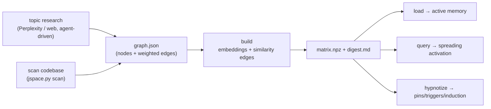

# J-space

Give yourself (the agent) an external, inspectable **mental workspace** for a
topic or codebase, modeled on the "J-space" from
[Anthropic's global-workspace research](https://www.anthropic.com/research/global-workspace):
a small set of word-linked concepts that a model reasons with. This skill turns a
subject into a weighted concept graph, compiles it into a matrix with local
embeddings, and lets you load / query / edit / checkpoint / hypnotize it so useful
vocabulary stays "lit up" and consistent across turns and sessions.



Everything the model needs (venv + embedding model) lives **outside the repo** at
`~/.j-space/`. All workspace **data** (`graph.json`, `matrix.npz`, checkpoints)
lives **in the analyzed project** at `./.jspace/`, so a workspace can travel with
the repo if you commit it. No cloud calls happen inside the scripts - only the
research step (which *you*, the agent, run) may use Perplexity/web.

> This is **context priming, not weight editing.** It cannot change model weights
> or literally inject activations. It builds a durable, inspectable prompt-side
> workspace that keeps the right concepts in front of you.

## Prerequisites

- **Python 3.11+** and **uv** (package manager). If uv is missing:
  `curl -LsSf https://astral.sh/uv/install.sh | sh`.
- **~500 MB disk** for the venv + the `all-MiniLM-L6-v2` embedding model
  (public, no Hugging Face account/token). Runs on Apple MPS if available, else
  CPU - works on any platform.
- Internet at setup only (to fetch the model). Build/query run fully offline.

## Setup

Resolve the skill directory and run setup once (creates the venv, installs
`numpy` + `sentence-transformers`, pre-downloads the model):

```bash
SKILL_DIR="<the folder this SKILL.md lives in>"   # e.g. .cursor/skills/j-space
bash "$SKILL_DIR/scripts/setup_env.sh"
```

Then set the handle the CLI runs under (setup prints it too):

```bash
JSPACE_HOME="${JSPACE_HOME:-$HOME/.j-space}"
PY="$JSPACE_HOME/.venv/bin/python"
JS="$SKILL_DIR/scripts/jspace.py"
```

Run every command from the **project root** you want the `.jspace/` data to live
in (the CLI reads/writes `./.jspace/` relative to the current directory).

## Workflow

Copy this checklist and track progress:

```
- [ ] 1. Pick a source: a TOPIC (research) or a CODEBASE (scan)
- [ ] 2. Produce a graph.json (author it from research, or scan + curate)
- [ ] 3. build → matrix.npz + digest.md
- [ ] 4. load at the start of a session; treat the digest as working vocabulary
- [ ] 5. query before non-trivial answers; use the lit-up concepts
- [ ] 6. edit / checkpoint as understanding evolves
- [ ] 7. (optional) hypnotize to pin/prime; wake to lift it
```

### Step 1-2a: Analyze a TOPIC (research → graph.json)

You build the graph from research. **Prefer the Perplexity MCP** (`perplexity_ask`)
if it is available; otherwise use web search. Ask specifically for:

- the **key concepts and sub-topics** of the subject,
- **expert / advanced terminology** a specialist would use,
- the **relationships** between those concepts (what connects to what).

Then distill the answers into `./.jspace/<name>/graph.json` yourself:

- `nodes`: 20-80 short concepts (single words or 2-3 word phrases), each with a
  `weight` in 0-1 (centrality to the topic) and an optional one-line `note`.
- `edges`: the explicit relationships you found, each with a `w` in 0-1 and an
  optional `rel` label. Don't try to be exhaustive - `build` adds semantic
  similarity edges automatically.

```jsonc
// ./.jspace/rust-async/graph.json
{
  "name": "rust-async",
  "topic": "asynchronous programming in Rust",
  "nodes": [
    { "word": "future", "weight": 1.0, "note": "a value that resolves later" },
    { "word": "executor", "weight": 0.9, "note": "drives futures to completion" },
    { "word": "poll", "weight": 0.8, "note": "Future::poll returns Ready/Pending" },
    { "word": "waker", "weight": 0.7, "note": "reschedules a task when ready" }
  ],
  "edges": [
    { "a": "executor", "b": "future", "w": 0.9, "rel": "drives" },
    { "a": "poll", "b": "waker", "w": 0.8, "rel": "registers" }
  ]
}
```

### Step 1-2b: Analyze a CODEBASE (scan → curate)

```bash
"$PY" "$JS" scan path/to/repo --name mycode --top 120
```

`scan` extracts candidate concepts from identifiers (splitting camelCase and
snake_case), filenames, headings, and comments, scores them TF-IDF-style, adds
co-occurrence edges, and writes a **draft** `graph.json`. **Curate it**: rename or
merge noisy terms, drop junk, adjust weights, add the real domain relationships.
Then build.

### Step 3: Build

```bash
"$PY" "$JS" build mycode          # [--sim-threshold 0.35] [--alpha 0.75]
```

Embeds every concept, adds cosine-similarity edges above the threshold,
row-normalizes the adjacency matrix, seeds activation from weights, and writes
`matrix.npz` + a `digest.md` (top concepts, clusters, and a **thought-sequence**
keyword chain). Sets this workspace as `current`.

### Step 4: Load into active memory

```bash
"$PY" "$JS" load mycode
```

Run this at the **start of a session** about that topic/codebase. It prints the
digest plus the currently-active concepts with their neighbors. **Read it and
adopt those concepts as your working vocabulary and priors** when you answer.

### Step 5: Query

```bash
"$PY" "$JS" query "how does backpressure work here?"
```

Seeds the concepts your text is about, spreads activation `k` times over the
graph, and prints the concepts that **light up**, each tagged by provenance:

- `[seed]` - directly matched your query text
- `[assoc]` - reached by association (spreading) - *these are the useful
  "related but unmentioned" leads*
- `[pin]` / `[trigger]` - surfaced by hypnosis (see below)

Activation **persists** across queries (concepts stay "on the workspace's mind"),
so a session builds continuity. Use the lit-up concepts - especially the
`[assoc]` ones - to reason in richer, more consistent terms.

### Step 6: Edit and checkpoint

```bash
"$PY" "$JS" edit --add "cancellation:0.6:dropping a future" --link "cancellation:waker:0.7"
"$PY" "$JS" edit --boost future --lower poll --remove somenoise
"$PY" "$JS" checkpoint --label "after-review"
"$PY" "$JS" checkpoint --list
"$PY" "$JS" checkpoint --restore .jspace/mycode/checkpoints/<file>.npz
```

`edit` mutates `graph.json` and rebuilds (reusing embeddings for unchanged
concepts). Checkpoints snapshot the whole workspace and restore exactly.

### Step 7 (optional): Hypnotize / wake

Plant persistent suggestions so concepts stay active without you re-querying:

```bash
# pin concepts, install a post-hypnotic trigger, and write an always-on rule
"$PY" "$JS" hypnotize --pin future --pin executor:0.8 \
  --trigger "poll => waker,executor" \
  --script "Reason about async in terms of the poll/wake state machine." \
  --install-rule

"$PY" "$JS" wake                 # lift it; restores the auto pre-hypnosis checkpoint
"$PY" "$JS" wake --only pins     # or clear just one category
```

- `--pin` clamps a concept active through every query and `load`.
- `--trigger "X => Y,Z"` force-lights Y and Z whenever X lights up.
- `--suppress` softly dampens a concept (see the caveat below).
- `--install-rule` writes `.cursor/rules/jspace-<name>.mdc` (`alwaysApply: true`)
  from the induction, so the workspace primes **you** automatically every session
  - no deliberate `load` needed. `hypnotize` always checkpoints first, so `wake`
  is safe.

## Key options

| Command | Key flags | Notes |
|---------|-----------|-------|
| `scan <dir> --name N` | `--top 120`, `--force` | draft graph.json from code |
| `build <name>` | `--sim-threshold 0.35`, `--alpha 0.75` | compile matrix + digest |
| `load [name]` | - | print digest + active concepts |
| `query "text"` | `--top 20`, `--iterations 5`, `--name` | spreading activation |
| `edit` | `--add w:wt[:note]`, `--link a:b:w`, `--boost w`, `--lower w`, `--remove w` | mutate + rebuild |
| `checkpoint` | `--label`, `--list`, `--restore FILE` | snapshots |
| `hypnotize` | `--pin w[:s]`, `--trigger "X => Y,Z"`, `--suppress w`, `--script`, `--install-rule` | plant suggestions |
| `wake` | `--only pins|triggers|suppressions` | lift induction |

## Anti-patterns

- **Vague or duplicated concepts.** Short, distinct concepts embed and cluster
  best. Merge near-synonyms; don't add both `"async"` and `"asynchronous"`.
- **Skipping curation after `scan`.** A raw scan is a *draft* full of generic
  identifiers - prune it before building or the graph is noise.
- **Treating suppression as a hard filter.** `--suppress` is *soft*: naming a
  concept to avoid it can paradoxically surface it (the "white-bear" effect from
  the research). Use it to nudge, not to guarantee absence.
- **Claiming this edits the model.** It is prompt-side context priming, not weight
  editing or activation injection. Be honest about that with the user.
- **Committing `~/.j-space/`.** The venv/model live there and must never enter a
  repo. The `./.jspace/` data is fine to commit if you want the workspace to
  travel with the project.
- **Huge graphs.** Best with a few dozen to a few hundred concepts. Past that,
  split into multiple named workspaces.

## Resources

- Matrix format, the spreading-activation math, tuning (`alpha`,
  `sim-threshold`, iterations), and troubleshooting: [REFERENCE.md](REFERENCE.md)
- The idea, the research mapping, a quickstart, and the honest hypnosis caveats,
  for humans: [README.md](README.md)
- The research this is modeled on:
  [A global workspace in language models](https://www.anthropic.com/research/global-workspace)
