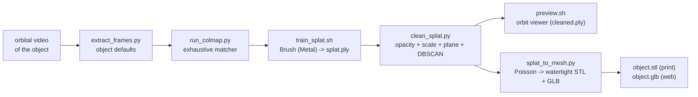

# Object to 3D (clean splat + printable STL, 100% local)

Turn a video orbiting a single object into two deliverables, entirely on-device:

1. a **clean Gaussian splat** of just the object (background, table and floaters
   removed) that you can navigate in the browser, and
2. a **watertight, millimeter-scaled STL** (plus a colored GLB) ready to slice
   and 3D-print.

The capture → splat half reuses the proven [video-to-splat](../video-to-splat/SKILL.md)
pipeline; this skill adds the two object-specific stages that follow training.



Everything lives **outside the repo** under `~/.video-to-splat/` (shared with
video-to-splat: same venv, Brush binary, and `projects/`), plus an orbit viewer
in `~/.video-to-splat/viewer-object/`. Nothing is ever uploaded anywhere.

## Prerequisites

- **Apple Silicon Mac (M1-M4), macOS 14+.** Brush trains on the Apple GPU via
  WebGPU/Metal and the pycolmap wheels are macOS-14 arm64 - there is no CUDA/CPU
  fallback for training/SfM.
- **uv** (Python env). If missing: `curl -LsSf https://astral.sh/uv/install.sh | sh`.
- **ffmpeg** and **node/npx**: `brew install ffmpeg node`.
- **~4-6 GB free disk** for the Brush binary, pycolmap, open3d, and the viewer's
  npm deps (downloaded once). Internet is needed only for that first setup.
- A browser with **WebGL2**: Chrome, Edge, Firefox, or Safari (for the splat preview).
- Mesh extraction (`clean_splat.py`, `splat_to_mesh.py`) is pure Python
  (open3d + trimesh) and runs on any CPU - only SfM/training need the Apple GPU.

## Setup

Resolve the skill directory and run setup once. It creates/verifies the shared
`~/.video-to-splat` layout (venv, Brush, projects), adds `open3d`/`trimesh` to
the venv, and installs the object orbit viewer:

```bash
SKILL_DIR="<the folder this SKILL.md lives in>"   # e.g. .cursor/skills/object-to-3d
bash "$SKILL_DIR/scripts/setup_env.sh"
```

Then set the handles the scripts use (setup prints them too):

```bash
VTS_HOME="${VIDEO_TO_SPLAT_HOME:-$HOME/.video-to-splat}"
PY="$VTS_HOME/.venv/bin/python"
```

If you already ran video-to-splat's setup, this reuses it and only adds the
extra Python deps + the orbit viewer.

## Workflow

Copy this checklist and track progress:

```
- [ ] 1. Setup: run setup_env.sh (first time only)
- [ ] 2. Extract frames from the orbital mp4 (extract_frames.py)
- [ ] 3. Recover camera poses + sparse cloud (run_colmap.py, exhaustive) - CHECK % registered
- [ ] 4. Smoke-train ~2000 steps to validate poses before committing time
- [ ] 5. Full train (train_splat.sh, default 30000 steps) -> splat.ply
- [ ] 6. Clean the splat (clean_splat.py) -> cleaned.ply ; preview.sh to verify, iterate flags
- [ ] 7. Extract the mesh (splat_to_mesh.py --size-mm N) -> object.stl + object.glb + turntable PNGs
- [ ] 8. Deliver: cleaned.ply (navigable) + object.stl (printable)
```

### Step 2: Extract frames

```bash
"$PY" "$SKILL_DIR/scripts/extract_frames.py" /path/to/object.mp4 --name my-object
```

- Object defaults: **`--fps 3`, `--max-frames 150`** (denser than a room tour -
  an orbit revisits the object from many close angles, and objects are small so
  frames stay sharp). Keeps the sharpest frame per window and drops near-dupes.
- Aim for **80-150 well-spread, in-focus frames** covering the whole object.
- Prints the project dir. Frames land in `~/.video-to-splat/projects/my-object/images/`.

### Step 3: Camera poses (Structure-from-Motion)

```bash
"$PY" "$SKILL_DIR/scripts/run_colmap.py" my-object            # exhaustive matcher (default)
```

- **Exhaustive matching is the default here** - an orbit is a loop of unordered
  close-up views, so any-to-any pairing is the robust choice (O(n^2), fine to
  ~400 frames). For a long single-pass sweep you can fall back to
  `--matcher sequential`.
- This is the make-or-break step. **Read the reported "% registered".** For a
  clean object orbit, aim **>90%**. If well under that, fix the capture/matching
  before training (see Capture guidance and REFERENCE.md).
- Writes the COLMAP model to `projects/my-object/sparse/0/` (largest first).

### Step 4: Smoke-train first (strongly recommended)

```bash
bash "$SKILL_DIR/scripts/train_splat.sh" my-object --steps 2000
bash "$SKILL_DIR/scripts/preview.sh" my-object --file splat.ply
```

**The gate is visual.** A broken pipeline can still export a well-formed .ply
that renders as noise. Open the preview and confirm you can recognize the object
before starting a full run. Fuzzy-but-recognizable → full training will sharpen
it. Unrecognizable nebula → poses/input are broken; revisit steps 2-3.

### Step 5: Full training

```bash
bash "$SKILL_DIR/scripts/train_splat.sh" my-object --steps 30000
```

- Trains with Brush and exports `projects/my-object/splat.ply`.
- Objects are small scenes, so training is comparatively fast (an object of
  ~100-150 frames is roughly single-room scale: budget ~1-2 min per 1000 steps
  on an M-series, i.e. tens of minutes for a full run - give the pessimistic
  number and do other work meanwhile).
- Progress: headless Brush prints nothing, but `splat.ply` is (over)written
  every `--export-every` steps (default 1000) - watch its mtime.

### Step 6: Clean the splat

Isolate just the object - remove the diffuse background, the support surface
(table/floor) and translucent floaters:

```bash
"$PY" "$SKILL_DIR/scripts/clean_splat.py" my-object               # auto clean -> cleaned.ply
bash  "$SKILL_DIR/scripts/preview.sh"    my-object --file cleaned.ply
```

Filters run in order (all tunable, see Key options and REFERENCE.md):

1. **Opacity** - drop near-transparent floaters (`sigmoid(opacity) < 0.4`).
2. **Scale** - drop the few gigantic, diffuse background blobs (top scale pctl).
3. **Support plane** - RANSAC-detect and remove the table/floor (on by default;
   `--keep-plane` to disable when the object has no flat contact surface).
4. **Clustering** - DBSCAN the remaining centers and keep the dominant cluster
   (the orbited object), dropping detached background islands.
5. **Manual crop (optional)** - after looking at the preview, tighten with
   `--radius R` (and `--center x,y,z`) to cut anything left.

**Iterate against the preview.** If background survives, raise `--min-opacity`
or lower `--scale-pctl`; if part of the object is eaten, relax them or add
`--keep-plane`. `cleaned.ply` keeps every Gaussian attribute, so it previews in
the orbit viewer exactly like the trained splat.

### Step 7: Extract the printable mesh

```bash
"$PY" "$SKILL_DIR/scripts/splat_to_mesh.py" my-object --size-mm 80
```

- Densifies each Gaussian into oriented surface samples, estimates normals,
  runs **Poisson reconstruction**, trims low-density fringe, keeps the largest
  connected component, fills holes and checks **watertightness** (reports
  volume + dimensions).
- `--size-mm N` scales the longest dimension to **N millimeters** (STL's de-facto
  unit) - SfM has no metric scale, so **you must set the real size** for a
  correct print. Default 100 mm.
- Outputs into `projects/my-object/mesh/`:
  - `object.stl` - watertight mesh for the slicer (print),
  - `object.glb` - colored mesh for the web / macOS QuickLook,
  - `turntable-*.png` - offscreen-rendered thumbnails for a quick visual check.
- Prefers `cleaned.ply`; pass `--file splat.ply` to mesh the raw splat, or
  `--no-densify` for a faster (coarser) pass. Raise `--depth` (Poisson octree,
  default 9) for more detail at the cost of noise/time.

### Step 8: Deliver

Deliverables live under `~/.video-to-splat/projects/my-object/`:
`cleaned.ply` (navigable object splat), `mesh/object.stl` (printable),
`mesh/object.glb` (web view), and the intermediate `splat.ply` master.

## Capture guidance (the #1 quality lever)

Object reconstruction quality is set on the camera far more than in any flag:

- **Orbit the object 360° at two heights** (a low ring ~15° above the table and
  a high ring ~45° looking down) so top and sides are both covered. Move slowly.
- **Keep the object still and the background textured.** Photogrammetry needs
  features to track: put the object on a patterned surface / newspaper, NOT a
  clean white sweep. A plain background gives COLMAP nothing to anchor on.
  (Turntable-with-static-camera is the opposite and usually fails - the object
  looks static against a moving world; orbit the camera instead.)
- **Lock exposure and focus**, use bright, even, diffuse light (no hard shadows
  that move with the object, no hotspots/specular glare).
- **Cover the whole surface**, including the top; the bottom (contact face) can't
  be seen and will be closed by Poisson - expect a flat/filled base there.
- **Avoid** mirrors, glass, chrome, thin transparent parts and featureless matte
  surfaces - SfM and splatting both struggle with them.

## Key options

| Script | Option | Default | Purpose |
|--------|--------|---------|---------|
| extract_frames.py | `--fps` | `3` | Target selected frames per second. |
| | `--max-frames` | `150` | Cap on frames (COLMAP time grows fast). |
| | `--max-size` | `1600` | Downscale long side (px). |
| run_colmap.py | `--matcher` | `exhaustive` | `exhaustive` (orbit, default) or `sequential`. |
| | `--max-features` | `8192` | SIFT features/image (raise for low-texture objects). |
| | `--relaxed` | off | Lower mapper thresholds; registers more frames. |
| train_splat.sh | `--steps` | `30000` | Training iterations (try `2000` to smoke-test). |
| | `--sh-degree` | `2` | SH degree 0-4 (higher = shinier + bigger). |
| clean_splat.py | `--min-opacity` | `0.4` | Drop Gaussians below this rendered opacity. |
| | `--scale-pctl` | `98` | Drop Gaussians above this percentile of max scale. |
| | `--keep-plane` | off | Skip RANSAC support-plane removal. |
| | `--plane-thresh` | auto | RANSAC inlier distance (scene-relative). |
| | `--min-frac` | `0.1` | Plane removed only if it holds ≥ this fraction. |
| | `--eps` | auto | DBSCAN neighborhood radius (auto-grows until a cluster dominates). |
| | `--min-dominant` | `0.5` | Grow eps until the biggest cluster holds this fraction (anti-shatter). |
| | `--keep-clusters` | `1` | How many top DBSCAN clusters to keep. |
| | `--no-cluster` | off | Skip clustering (for already-isolated splats). |
| | `--radius` / `--center` | off | Manual spherical crop after the preview. |
| splat_to_mesh.py | `--size-mm` | `100` | Scale longest dimension to N mm (set the real size!). |
| | `--depth` | `9` | Poisson octree depth (detail vs. noise/time). |
| | `--density-quantile` | `0.03` | Trim this low-density fraction of Poisson output. |
| | `--samples-per-splat` | `4` | Surface samples per Gaussian (densify). |
| | `--no-densify` | off | Use Gaussian centers only (faster, coarser). |
| | `--file` | `cleaned.ply` | Which splat to mesh (falls back to splat.ply). |
| preview.sh | `--file` | auto | Specific file to load (e.g. `cleaned.ply`). |
| | `--port` | `5173` | Vite port. |

## Anti-patterns

- **Meshing the raw splat.** Always clean first - background/table points wreck
  Poisson (it wraps a surface around them). Clean → preview → mesh.
- **Trusting the size without `--size-mm`.** SfM is scale-free; an unset size
  prints at an arbitrary scale. Measure the real object and pass it.
- **Skipping the smoke run / visual check.** Training on bad poses is the most
  expensive mistake; read "% registered" and preview 2k steps first.
- **Plain white background / turntable-with-fixed-camera capture.** Both starve
  COLMAP of trackable features and usually fail to register - orbit the camera
  around an object on a textured surface.
- **Expecting a printable bottom.** The contact face is never seen; Poisson
  closes it flat. Orient the print accordingly.
- **Committing anything under `~/.video-to-splat/`** into a repo - large and
  regenerable.

## Resources

- Tool matrix, licenses, cleanup/Poisson parameter deep-dive, format notes, and
  troubleshooting: [REFERENCE.md](REFERENCE.md)
- Shared capture→splat pipeline details (Brush CLI, pycolmap, SfM playbook):
  [../video-to-splat/REFERENCE.md](../video-to-splat/REFERENCE.md)
