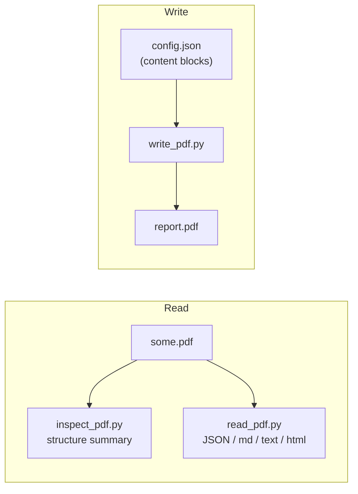

# PDF Document Processing

Read PDFs with real structural understanding (**Docling**) and create
professional PDFs (**fpdf2**), 100% locally. `.pdf` files are binary — **never
open one with a text/Read tool**; use `inspect_pdf.py` / `read_pdf.py` to see
inside, and `write_pdf.py` to author new ones.



## Prerequisites

- **Python 3.9+** (any OS). [`uv`](https://astral.sh/uv) is used if present for
  a faster install, otherwise the stdlib `venv` + `pip` are used.
- Dependencies installed by setup into a local venv: **docling** (reading) and
  **fpdf2** (writing); on macOS the `docling[ocrmac]` extra is added for native
  Vision OCR.
- **~1-2 GB disk** for Docling's layout/table models, downloaded on the **first
  read** (not at setup) into `~/.cache/huggingface`. Internet is needed only for
  that first fetch; your PDFs never leave the machine.

## Setup

Resolve the skill directory and run setup **once**. It creates a venv at
`~/.pdf-documents/.venv`, installs the deps, and prints the venv python on its
last line:

```bash
SKILL_DIR="<the folder this SKILL.md lives in>"   # e.g. .cursor/skills/pdf-documents
bash "$SKILL_DIR/scripts/setup_env.sh"
```

Then set the handles the commands below use (setup prints `PY` too):

```bash
PY="$HOME/.pdf-documents/.venv/bin/python"
SCRIPTS="$SKILL_DIR/scripts"
```

## Workflow: extract data from a PDF

```
- [ ] 1. Inspect structure (inspect_pdf.py) — pages, tables, headings, size
- [ ] 2. Read with the right flags (read_pdf.py --extract-tables / --ocr)
- [ ] 3. Transform the JSON as needed (optionally hand tables to the xlsx-excel skill)
```

### inspect_pdf.py — structure summary

```bash
$PY "$SCRIPTS/inspect_pdf.py" input.pdf [--verbose]
```

Prints JSON: page count, file size, element-type counts, headings, per-table
column/row counts, and total characters/words. `--verbose` adds a text preview
and a sample table row. Use this first to decide what to extract.

### read_pdf.py — full extraction

```bash
# Structured JSON (default): markdown + text + sections (+ table_count)
$PY "$SCRIPTS/read_pdf.py" input.pdf -o data.json

# Pull tables as headers/rows + HTML
$PY "$SCRIPTS/read_pdf.py" input.pdf --extract-tables -o data.json

# OCR a scanned PDF (native Vision engine on macOS)
$PY "$SCRIPTS/read_pdf.py" scanned.pdf --ocr -o data.json

# Other formats, or a URL source
$PY "$SCRIPTS/read_pdf.py" input.pdf --format markdown -o out.md
$PY "$SCRIPTS/read_pdf.py" https://example.com/doc.pdf --format text
```

`--format` is one of `json` (default), `markdown`, `text`, `html`;
`--extract-images DIR` saves page images. The input may be a local path **or**
an `http(s)` URL.

## Workflow: create a professional PDF

```
- [ ] 1. Shape the data into content blocks (JSON config, schema below)
- [ ] 2. Write the config to a temp .json
- [ ] 3. Run write_pdf.py, then open/verify the output
```

```bash
$PY "$SCRIPTS/write_pdf.py" config.json report.pdf
```

The config has optional `metadata`, `page`, `header`, `footer`, and a `content`
array of typed blocks rendered in order:

| Block `type` | Purpose |
|---|---|
| `title` / `subtitle` | Large centered title + subtitle |
| `heading` | Section heading, `level` 1-3 (level 1 gets an underline) |
| `paragraph` | Body text, `align` `L`/`C`/`R`/`J` |
| `table` | Headers + rows, `col_widths`, per-column `align`, header/row styling, alternating fill |
| `image` | Embedded image with `width`, `align`, optional `caption` |
| `bullet_list` / `numbered_list` | List items |
| `key_value` | Key → value rows (KPIs/metrics) |
| `spacer` / `divider` / `page_break` | Vertical space / rule / new page |

Colors are `[R, G, B]` (0-255). Minimal example:

```json
{
  "metadata": { "title": "Q4 Report", "author": "Acme" },
  "footer": { "text": "Confidential", "show_page_numbers": true },
  "content": [
    { "type": "title", "text": "Quarterly Report" },
    { "type": "heading", "text": "Summary", "level": 1 },
    { "type": "paragraph", "text": "Revenue grew across all segments." },
    { "type": "table",
      "headers": ["Quarter", "Revenue", "Growth"],
      "rows": [["Q3", "$52k", "86%"], ["Q4", "$95k", "83%"]],
      "align": ["L", "R", "R"] }
  ]
}
```

The full schema (every block's fields, header/footer/page options, color
palettes) and advanced fpdf2/Docling recipes are in [REFERENCE.md](REFERENCE.md).

## Critical rules

- **Never Read/`cat` a `.pdf`** — it's binary. Use `inspect_pdf.py` /
  `read_pdf.py`.
- **Always `inspect` before a big extraction** so you request the right flags
  (`--extract-tables`, `--ocr`) instead of re-converting.
- **`--ocr` is only for scanned/image PDFs** — it's slower and unneeded for
  born-digital PDFs (which already have a text layer).
- For **structured data** (tables → spreadsheet), read with `--extract-tables`
  and hand the JSON to the `xlsx-excel` skill rather than eyeballing text.

## Limitations

- First read triggers a one-time ~1-2 GB model download (Docling); it needs
  network that once, then runs offline.
- Docling reconstructs structure heuristically — verify extracted tables from
  complex/merged-cell layouts.
- `write_pdf.py` uses the core Helvetica font (Latin-1). For non-Latin scripts
  or custom fonts, use fpdf2's `add_font` directly (see REFERENCE.md).
- Writing embeds images but does not itself generate charts — render a chart to
  PNG first (matplotlib recipe in REFERENCE.md), then add it as an `image`.

## Resources

- Full write-config schema, advanced Docling pipeline/OCR/batch usage, fpdf2
  tables/KPIs/callouts/watermarks/charts, and color schemes: [REFERENCE.md](REFERENCE.md).
