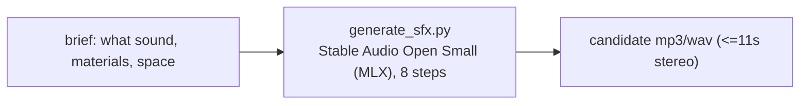

# Sound Effects

Generate original sound effects and ambience from a text brief, fully offline. A
thin wrapper drives **Stable Audio Open Small** (a diffusion text-to-audio model
Stability trained to be "better at sound effects and field recordings than
music"); **you** (the model) shape the brief into a concrete prompt, generate a
couple of candidates, and let the user pick.

Pairs with **audio-theater** (which cues SFX into a radio drama / podcast) and
**bg-music** (music beds). For music, use bg-music; this skill is for non-musical
sound.



Everything lives **outside the repo** at `~/.sound-effects/` (the venv, weights,
and generated audio), never in the repo.

> **No Hugging Face account or token is needed.** The weights are a *public,
> pre-converted* MLX build (`jasonvassallo/mlx-stable-audio`) that downloads
> anonymously. (Stability's *original* weights are gated, but this skill never
> uses them unless you opt into the advanced self-conversion path in
> [REFERENCE.md](REFERENCE.md).)

## Prerequisites

- **Apple Silicon Mac** (M1-M4). mlx-audiogen runs the model on the Apple GPU via
  MLX; there is no CPU/CUDA path in this skill. ~4-6 GB RAM for inference.
- **uv** (package manager). Setup installs mlx-audiogen into an isolated venv. If
  missing: `curl -LsSf https://astral.sh/uv/install.sh | sh`.
- **ffmpeg** on PATH (MP3 encoding). Stop and ask the user to `brew install ffmpeg`
  if missing.
- **~1-2 GB free disk** for the pre-converted model weights (downloaded once, at
  setup, from a **public** HF repo - no account or token).
- Internet at setup only (to fetch weights). Generation runs fully offline.

## Setup

Resolve the skill directory and run setup once (creates the venv, installs
mlx-audiogen, and pre-downloads the public weights anonymously):

```bash
SKILL_DIR="<the folder this SKILL.md lives in>"   # e.g. .cursor/skills/sound-effects
bash "$SKILL_DIR/scripts/setup_env.sh"
```

Then set the handle used by the script (setup prints it too):

```bash
SFX_HOME="${SOUND_EFFECTS_HOME:-$HOME/.sound-effects}"
PY="$SFX_HOME/.venv/bin/python"
```

> Setup pulls the public MLX weights (`jasonvassallo/mlx-stable-audio`) into
> `~/.sound-effects/weights/` with **no login**. Use `--no-weights` to skip
> (they auto-download on first generation), point `SFX_WEIGHTS_DIR` at a local
> mirror to run air-gapped, or `SFX_WEIGHTS_REPO` at a different public repo.

## Workflow

Copy this checklist and track progress:

```
- [ ] 1. Confirm the brief: what sound, concrete source/materials, the space
- [ ] 2. Setup: run setup_env.sh (first time only)
- [ ] 3. Write a concrete prompt; generate 2 candidates
- [ ] 4. Play/link the candidates; let the user pick (regenerate if needed)
- [ ] 5. Deliver the mp3(s)
```

### Step 1: Nail the brief

Quality depends on a concrete prompt that names the **source and materials** and,
for ambience, the **space**. Pull these from the user (or infer and state them):

- **What makes the sound**: a heavy wooden door, dry leaves, a ceramic mug on stone.
- **Action / motion**: slamming, crunching underfoot, setting down.
- **Space / distance**: close-miked, in a small tiled room, distant across a field.

### Step 3: Generate

```bash
"$PY" "$SKILL_DIR/scripts/generate_sfx.py" \
  "heavy wooden door slamming shut in a stone hallway, close-miked" \
  --duration 3 --count 2 \
  --output "$SFX_HOME/out/door.mp3"
```

- Output is stereo, up to **~11s** (the model's limit). For a longer ambient bed,
  generate a short seamless-ish clip and **loop** it in your editor / the
  audio-theater mixer.
- `--count 2` produces two variations (`door-1.mp3`, `door-2.mp3`).
- Writes files and prints their paths. Uses the local weights from setup (offline);
  if they are missing it auto-downloads the public weights (still no HF account).

Prompt patterns that work well:

- **One-shots**: name the object + material + action + space —
  `"single dry twig snapping underfoot on a forest trail"`.
- **Repeated/continuous actions**: describe the full sequence, not one hit —
  `"a sequence of several footsteps crunching on gravel"` (a bare "footstep"
  renders one thin tap).
- **Ambience/beds**: describe the environment —
  `"steady heavy rain on a tin roof, distant thunder, no music"`.
- Add `"no music"` for pure foley; Stable Audio can drift musical otherwise.

### Step 4: Review and pick

Play/link the candidates so the user can choose. Regenerate with a new `--seed`, a
more concrete prompt, or `--sampler rk4 --steps 20` for a higher-quality take.

### Step 5: Deliver

Embed or link the chosen mp3. Generated files stay under `~/.sound-effects/out/`.

## Key options (generate_sfx.py)

| Option | Default | Purpose |
|--------|---------|---------|
| `prompt` (positional) or `--prompt` | (required) | Sound description. |
| `--duration` / `-d` | `8` | Seconds (1-11; capped at 11, the model limit). |
| `--count` | `1` | How many variations (distinct seeds). |
| `--steps` | `8` | Diffusion steps (8 fast; 20-30 for higher quality). |
| `--cfg-scale` | `6.0` | Classifier-free guidance (prompt adherence). |
| `--sampler` | `euler` | `euler` (faster) or `rk4` (higher quality). |
| `--negative-prompt` | none | What to avoid (e.g. `"music, melody"`). |
| `--seed` | random | Base seed; candidate i uses `seed+i`. |
| `--format` / `-f` | `mp3` | `mp3` or `wav`. |
| `--output` / `-o` | `out/sfx-<ts>.mp3` | Output path (or prefix when `--count > 1`). |
| `--mp3-quality` | `2` | ffmpeg `libmp3lame -q:a` (0=best..9=smallest). |
| `--weights-dir` | `~/.sound-effects/weights/...` | Local pre-converted weights (offline). Falls back to public auto-download. |

## Safety

- **Disclose AI-generated audio** where the platform or context calls for it.
- **Commercial use:** Stable Audio Open Small is under the **Stability AI Community
  License** (free for individuals and organizations under **$1M annual revenue**;
  above that, a commercial license from Stability is required). This is **not** as
  permissive as the Apache/MIT models used by the repo's other skills - verify
  your use before shipping commercially. See
  [stability.ai/license](https://stability.ai/license).
- **Never upload** prompts or generated audio to any external service. Everything
  stays local under `~/.sound-effects/`.

## Anti-patterns

- Vague prompts ("a sound", "something scary") - name the source, material, action,
  and space.
- Prompting a single event for a continuous action ("footstep" instead of "several
  footsteps on gravel") - you get one thin tap.
- Expecting long clips - the model caps around 11s; loop a short clip for beds.
- Expecting realistic **music** from this model - it is tuned for SFX; use the
  **bg-music** skill for music.
- Committing anything from `~/.sound-effects/` or the HF cache into a repo.

## Resources

- Model background, prompt cookbook by category, the loop-for-beds recipe,
  licensing detail, and troubleshooting: [REFERENCE.md](REFERENCE.md)
- Cueing SFX into a full radio drama / podcast: the **audio-theater** skill.
- Music beds and jingles: the **bg-music** skill.
