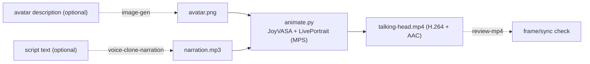

# Talking Head Video

Turn a still avatar image + a narration track into a lip-synced talking-head
MP4, fully offline. A thin wrapper drives **JoyVASA** (audio -> facial-motion
diffusion) rendered by **LivePortrait**; **you** (the model) prepare a good
avatar and narration, animate, review, and deliver.

This is the capstone of the local media set: it composes with the other skills
so the whole thing - face, voice, music - is generated on-device.



Everything lives **outside the repo** at `~/.talking-head/` (the JoyVASA
checkout, venv, model weights, and output videos).

## Prerequisites

- **Apple Silicon Mac** (M1-M4). The renderer runs on the Apple GPU (MPS) via
  PyTorch; a couple of ops fall back to CPU automatically. 16 GB unified memory
  is enough. There is a `--force-cpu` fallback but it is much slower.
- **uv**, **git**, and **ffmpeg** on PATH. If missing: `brew install ffmpeg`,
  `curl -LsSf https://astral.sh/uv/install.sh | sh`.
- **~6 GB free disk** for the checkout + model weights (downloaded once from
  Hugging Face, anonymously - no token).
- Internet on first setup only (code + weights). Generation is offline.

## Setup

Resolve the skill directory and run setup once (clones JoyVASA, builds a
macOS-native venv, patches a few CUDA defaults, and downloads weights - the
first run takes several minutes):

```bash
SKILL_DIR="<the folder this SKILL.md lives in>"   # e.g. .cursor/skills/talking-head
bash "$SKILL_DIR/scripts/setup_env.sh"
```

Then set the handles used by generation (setup prints these too):

```bash
TH_HOME="${TALKING_HEAD_HOME:-$HOME/.talking-head}"
PY="$TH_HOME/.venv/bin/python"
```

## Workflow

Copy this checklist and track progress:

```
- [ ] 1. Get an avatar image (front-facing) - or generate one with image-gen
- [ ] 2. Get a narration mp3/wav - or generate one with voice-clone-narration
- [ ] 3. Setup: run setup_env.sh (first time only)
- [ ] 4. Animate: animate.py --image ... --audio ... --out ...
- [ ] 5. Review the mp4 (review-mp4) - check identity, lip-sync, artifacts
- [ ] 6. (optional) Add background music with bg-music; deliver
```

### Step 1: Avatar image

Use a provided photo, or generate one with the **image-gen** skill. A good
avatar for lip-sync is:

- **Front-facing**, looking at the camera, head upright.
- **Mouth closed** (or neutral), eyes open, a **single** clearly visible face.
- **Head-and-shoulders** framing on a plain background.
- Square-ish, roughly 512-1024 px (larger is fine; it is processed at 512).

A ready-made image-gen prompt:

```
head-and-shoulders portrait photograph of a friendly presenter, looking straight
at the camera, direct eye contact, neutral closed-mouth expression, head upright
and centered, soft studio lighting, plain light-gray background, sharp focus,
natural skin texture
```

The frontal pose is not optional: a 3/4 view, an off-camera gaze, or an open
mouth in the source image makes the warping fight the pose for the whole clip
and the result looks bad. If a generated avatar comes out even slightly turned,
regenerate with another seed rather than animating it.

### Step 2: Narration audio

Use a provided mp3/wav, or generate one with the **voice-clone-narration** skill
(English or Spanish). Any sample rate works - `animate.py` converts to 16 kHz
mono internally. Keep clips reasonable (see speed note below).

### Step 4: Animate

```bash
"$PY" "$SKILL_DIR/scripts/animate.py" \
  --image ~/.image-gen/out/portrait.png \
  --audio ~/.voice-clone-narration/out/narration-en.mp3 \
  --cfg-scale 1.5 --crop \
  --out "$TH_HOME/out/talkinghead.mp4"
```

- **Use `--crop` by default.** It animates only the detected face region and
  pastes it back onto the still original frame, so the background and image
  corners stay perfectly static, and the output keeps the source resolution.
  Without it, LivePortrait warps the *whole* frame and the corners/background
  visibly wobble (and output is downscaled to 512x512).
- `--cfg-scale` (default 2.0) controls expressiveness: 1.5-2.5 is the useful
  range. Higher values over-animate - the telltale sign is eyes popping wide
  open on emphasis. Start at 1.5 for a calm presenter read.
- If the eyes still over-animate, add `--animation-region lip` to animate the
  mouth only (eyes and head stay as in the source - more static but artifact-free).
- Output is an H.264 + AAC mp4 with the narration muxed in, at the audio's
  duration. Prints the output path on the last stdout line.
- Add `--force-cpu` only if you hit an MPS op error (much slower).

### Step 5: Review

Use the **review-mp4** skill (or extract a few frames with ffmpeg) to check that
identity is preserved, the lips track the speech, and there are no artifacts. If
the mouth barely moves, raise `--cfg-scale`; if it over-moves (wide "popping"
eyes), lower it or use `--animation-region lip`. If the background or frame
corners wobble, you forgot `--crop`. If the face is not tracked, provide a more
front-facing avatar.

### Step 6: Deliver (optionally with music)

Optionally lay a bed under the voice with the **bg-music** skill's
`mix_voiceover.sh`, then use that mixed track as the `--audio` input here (so the
lips still track the voice), or add music in a final video edit. Deliver the mp4.

## Languages (English / Spanish)

The motion model is audio-driven from phonetic features, so it lip-syncs
**language-agnostically**. English and Spanish narrations both work well - just
feed the corresponding mp3. (The audio encoder was trained on Chinese+English;
Spanish phonemes map cleanly enough for convincing sync.)

## Speed

On an M4 / 16 GB, rendering is roughly **~24 s of compute per 1 s of video** at
512x512 (the `grid_sampler_3d` op falls back to CPU). Practical guide:

| Narration length | Approx. render time |
|------------------|---------------------|
| 5 s   | ~2 min |
| 10 s  | ~4 min |
| 30 s  | ~12 min |
| 60 s  | ~24 min |

Keep clips short for iteration; batch longer renders. First run also downloads
weights once.

## Key options (animate.py)

| Option | Default | Purpose |
|--------|---------|---------|
| `--image` | (required) | Avatar/portrait image (front-facing, mouth closed). |
| `--audio` | (required) | Narration mp3/wav/m4a (auto-converted to 16 kHz mono). |
| `--out` | `out/talkinghead-<ts>.mp4` | Output mp4 path. |
| `--cfg-scale` | `2.0` | Motion guidance / expressiveness (1.5-2.5 useful range; high = popping eyes). |
| `--animation-region` | `all` | `all`, `lip`, `exp`, `pose`, or `eyes`. `lip` = mouth only, most stable. |
| `--crop` | off | Animate the face crop and paste back onto the still frame. **Recommended: keeps background/corners static and preserves source resolution.** |
| `--force-cpu` | off | Disable MPS (most compatible, much slower). |

## Safety

- **Consent and likeness:** only animate a real person's face with their
  permission. Do not impersonate real individuals or create misleading content.
- **No deepfakes / disinformation.** Do not put words in a real person's mouth.
- **Disclose AI-generated video** where the platform or context calls for it.
- **Licensing:** JoyVASA and LivePortrait are MIT and the LivePortrait weights
  Apache-2.0, but the pipeline uses InsightFace face-detection models that are
  **research-only / non-commercial**. Fine for demos and internal reels; for a
  commercial product, review [REFERENCE.md](REFERENCE.md) and swap the detector.
- **Never upload** avatars, audio, or videos to any external service. Everything
  stays local under `~/.talking-head/`.

## Anti-patterns

- Feeding a profile shot, tiny face, sunglasses, or a multi-face group photo -
  detection/animation degrades. Use a single front-facing head-and-shoulders
  portrait (generate one with image-gen if needed).
- Rendering a 2-minute clip to iterate - test with a short narration first.
- Expecting real-time - this is minutes-per-clip on a Mac, not instant.
- Cranking `--cfg-scale` very high to "fix" weak motion - it looks jittery and
  the eyes pop. Try 2.0-2.5 at most, and make sure the source mouth is closed.
- Rendering without `--crop` and wondering why the background/corners warp -
  full-frame warping is how the renderer works; crop+pasteback is the fix.
- Committing anything from `~/.talking-head/` into a repo.

## Resources

- Architecture, model matrix + licenses (incl. the InsightFace caveat), the
  macOS/MPS adaptations, rejected alternatives, and troubleshooting:
  [REFERENCE.md](REFERENCE.md)
- Generating the avatar: the **image-gen** skill.
- Generating the narration (EN/ES): the **voice-clone-narration** skill.
- Background music bed: the **bg-music** skill.
- Verifying the output video: the **review-mp4** skill.
