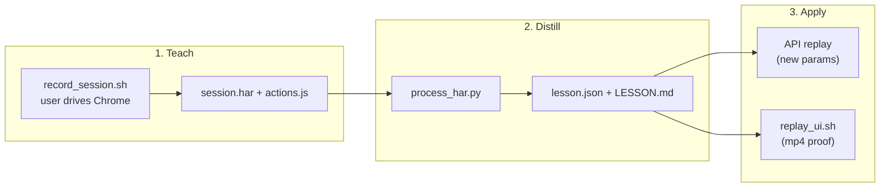

# Teach Web Actions

Learn a website by watching the user do something once, then do a variation of
it yourself. The skill has three phases; every phase is a script in this
skill's `scripts/` directory, and **you** (the model) are the reasoning glue
between them.



Lessons live **outside the repo** at `~/.web-lessons/<host>/<lesson-name>/`.
HARs contain live cookies and tokens — never commit, print, or upload them
(see [Safety](#safety)).

## Prerequisites

- **Node.js** + **npx** (Playwright codegen and the UI replay runner).
- **Google Chrome** installed (default channel is `chrome`; set
  `PW_CHANNEL=chromium` to use Playwright's bundled browser instead, or
  `PW_CHANNEL=msedge`).
- **python3** (HAR distiller — stdlib only, no pip installs).
- **ffmpeg** on PATH (only for Phase 3 UI replay: webm → mp4).

First run of `record_session.sh` / `replay_ui.sh` installs the `playwright` npm
package into `scripts/node_modules` automatically. `replay_ui.sh` also fetches
Playwright's own bundled ffmpeg (needed for video capture, separate from the
system `ffmpeg` used for the webm-to-mp4 step), and for `PW_CHANNEL=chromium`
the bundled browser. If the machine has no network, install ahead of time from
`scripts/` (`npm install`, then `npx playwright install ffmpeg [chromium]`).

## Workflow

Copy this checklist and track progress:

```
- [ ] 1. Confirm the exact action the user will demonstrate + the start URL
- [ ] 2. Record: run record_session.sh, tell the user what to do, wait for close
- [ ] 3. Distill: run process_har.py, read LESSON.md, report actions learned
- [ ] 4. Confirm the variation the user wants (new params / different flow)
- [ ] 5. Apply: API replay (data) or replay_ui.sh (mp4 proof)
- [ ] 6. Report results; never print cookies/tokens
```

Resolve the skill directory (wherever it was installed) once:

```bash
SKILL_DIR="<the folder this SKILL.md lives in>"   # e.g. .cursor/skills/teach-web-actions
```

## Phase 1 — Record (teach mode)

Pin down **one concrete action** with the user first (source/target, dates,
search terms — whatever the variation will later change), then launch:

```bash
bash "$SKILL_DIR/scripts/record_session.sh" <lesson-name> <start-url>
# e.g.
bash "$SKILL_DIR/scripts/record_session.sh" flight-availability "https://www.example-air.com"
```

Then tell the user, in plain words, exactly what to do in the Chrome window
that opens, e.g.:

> Chrome is open. Please search a one-way flight from **LAX** to **JFK**
> departing **2026-08-14**, then close the window when the results show.

The script:

- Opens Chrome via `playwright codegen` with a **persistent profile**
  (`~/.web-lessons/.browser-profile`) so logins carry across sessions
  (Chrome 136+ blocks automation of the *default* profile, so this uses a
  dedicated one).
- Writes `session.har` (all network activity) and `actions.js` (the UI steps,
  `--target javascript`) into the lesson directory.
- Writes `meta.json` (lesson name, start URL, host, timestamp).

**Wait for the user to finish and close the browser** before moving on — the
HAR is flushed on close. The script prints the lesson directory path; capture
it as `LESSON_DIR`.

## Phase 2 — Distill

```bash
python3 "$SKILL_DIR/scripts/process_har.py" "$LESSON_DIR"
```

This reads `session.har` (+ `actions.js`, `meta.json`), drops noise (static
assets, analytics/telemetry hosts), keeps XHR/fetch/document requests, and
writes:

- `lesson.json` — machine-readable: endpoints grouped by method + path
  template, example payloads, detected **parameter candidates** (the knobs to
  turn — dates, IATA-like codes, ids, pagination, search terms), and the
  **auth surface** (cookie/header names required, values redacted).
- `LESSON.md` — human-readable summary of the same.

**Read `LESSON.md`** and report to the user *what actions were learned* — the
endpoints, what each seems to do, and which parameters can vary. This is the
answer to "what did you learn to do". See [REFERENCE.md](REFERENCE.md) for the
schema and the parameter/auth heuristics.

## Phase 3 — Apply a variation

Confirm the variation (e.g. "same search, but SFO→SEA on 2026-09-02"), then
pick a mode:

| Want | Mode | Why |
|------|------|-----|
| Data for a different query (availability, prices, listings) | **API replay** | Fast, deterministic; no browser |
| Visual proof of a UI flow, or the app is JS-heavy / hard to call directly | **UI replay** | Produces an mp4; drives the real UI |

### API replay

From `lesson.json`, pick the endpoint that produced the result (usually the
XHR/fetch whose response held the data). Reissue it with substituted
parameters, reusing the session:

- Take cookies/headers from `session.har` for that host — **read them from the
  file at call time; never echo them into chat or logs.**
- Swap the `param_candidates` you want to vary (dates, origin/destination, ids).
- Use `curl` or python `requests`. Prefer this only for **idempotent reads**
  (GET/search). For anything that mutates state, see [Safety](#safety).

Then interpret the response for the user (parse JSON, summarize the answer).

### UI replay with mp4 proof

1. Read `actions.js` (the recorded steps) and write a **variant module** at
   `$LESSON_DIR/variant.js` that exports a single async function taking `page`,
   with your substituted inputs. Contract:

```js
module.exports = async (page) => {
  await page.goto('https://www.example-air.com');
  await page.getByLabel('From').fill('SFO');
  await page.getByLabel('To').fill('SEA');
  await page.getByLabel('Depart').fill('2026-09-02');
  await page.getByRole('button', { name: 'Search' }).click();
  await page.waitForSelector('.results');
};
```

   (Lift the `await page....` lines from `actions.js`, change the inputs, and
   drop the browser-launch boilerplate — the runner supplies `page`.)

2. Run it; the runner reuses the persistent profile, records video, and
   converts it to mp4:

```bash
bash "$SKILL_DIR/scripts/replay_ui.sh" "$LESSON_DIR" "$LESSON_DIR/variant.js"
```

3. It prints `proof.mp4` under `$LESSON_DIR/runs/<timestamp>/`. Hand that path
   to the **review-mp4** skill to verify the flow and describe what happened,
   and embed/link the mp4 for the user.

## Safety

- **Secrets:** `session.har`, the browser profile, and `variant.js` can contain
  cookies, bearer tokens, and personal data. Never commit them, never paste
  their contents into chat, never upload them anywhere. `lesson.json`/`LESSON.md`
  redact credential *values* but still name what's required — treat them as
  sensitive too. Everything stays under `~/.web-lessons/`, outside any repo.
- **Only replay reads autonomously.** GET/search-style calls that just fetch
  data are fine to vary on your own. **Stop and ask the user before replaying
  anything that mutates state** — bookings, purchases, posts, deletes, form
  submissions, or any non-idempotent request. Recording such a flow is fine;
  re-firing it is not, without explicit confirmation.
- **Stay on the user's own session.** This skill reuses the session the user
  established; it does not harvest credentials or bypass auth. Respect the
  target site's terms.
- **One lesson, one host.** Don't reuse a lesson's payloads against a different
  site.

## Anti-patterns

- Printing or committing `session.har`, cookies, or tokens — they're live
  credentials.
- Replaying a state-changing request (booking/purchase/delete) without asking.
- Reading raw HAR entries by hand instead of running `process_har.py` — you'll
  drown in static assets and miss the parameter knobs.
- Hardcoding one endpoint's payload for a different site or a different action.
- Skipping the "tell the user exactly what to demonstrate" step — a vague
  recording yields a vague lesson.

## Resources

- HAR anatomy, the `lesson.json` schema, parameter-detection and auth
  heuristics, and video-conversion details: [REFERENCE.md](REFERENCE.md)
- Verifying and describing the replay mp4: the **review-mp4** skill.
