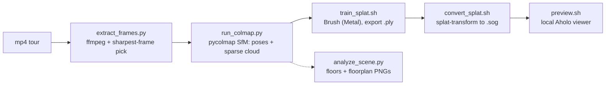

# Video to Gaussian Splat (Aholo-compatible, 100% local)

Turn an mp4 walkthrough into a 3D Gaussian splat and preview it in the browser,
entirely on-device. Thin wrappers drive four proven open-source tools; **you**
(the model) shepherd the run, judge reconstruction quality, and decide when to
commit to a full-length training run.



"Compatible with the Aholo viewer" just means a standard trained splat: Aholo
loads `PLY`, `SPZ`, `SOG`, `SPLAT`, `KSPLAT`, and `LCC`. We produce a lossless
`.ply` master plus a compact `.sog` for the web (the format Aholo and PlayCanvas
recommend for streaming).

Everything lives **outside the repo** under `~/.video-to-splat/` (venv, the Brush
binary, the viewer app, and per-project frames/models/splats). Nothing is ever
uploaded anywhere.

## Prerequisites

- **Apple Silicon Mac (M1-M4), macOS 14+.** Brush trains on the Apple GPU via
  WebGPU/Metal and the pycolmap wheels are macOS-14 arm64 - there is no CUDA/CPU
  fallback in this skill.
- **uv** (Python env). If missing: `curl -LsSf https://astral.sh/uv/install.sh | sh`.
- **ffmpeg** and **node/npx**: `brew install ffmpeg node`.
- **~3-5 GB free disk** for the Brush binary, pycolmap, and the viewer's npm deps
  (downloaded once). Internet is needed only for that first setup.
- A browser with **WebGPU**: **Chrome or Edge 134+** (Safari/Firefox won't render
  the preview yet).

## Setup

Resolve the skill directory and run setup once (creates the venv, downloads the
Brush binary, installs the viewer):

```bash
SKILL_DIR="<the folder this SKILL.md lives in>"   # e.g. .cursor/skills/video-to-splat
bash "$SKILL_DIR/scripts/setup_env.sh"
```

Then set the handles the scripts use (setup prints them too):

```bash
VTS_HOME="${VIDEO_TO_SPLAT_HOME:-$HOME/.video-to-splat}"
PY="$VTS_HOME/.venv/bin/python"
```

## Workflow

Copy this checklist and track progress:

```
- [ ] 1. Setup: run setup_env.sh (first time only)
- [ ] 2. Extract frames from the mp4 (extract_frames.py)
- [ ] 3. Recover camera poses + sparse cloud (run_colmap.py) - CHECK the % registered
- [ ] 3b. (multi-story / floorplan wanted) analyze_scene.py: floors + floorplan PNGs
- [ ] 4. Smoke-train ~2000 steps to validate poses before committing hours
- [ ] 5. Full train (train_splat.sh, default 30000 steps) -> splat.ply
- [ ] 6. Compress to .sog (convert_splat.sh)
- [ ] 7. Preview in the Aholo viewer (preview.sh) and deliver
```

### Step 2: Extract frames

```bash
"$PY" "$SKILL_DIR/scripts/extract_frames.py" /path/to/tour.mp4 --name my-tour --fps 2
```

- Oversamples, keeps the **sharpest frame per window** (rejects motion blur), and
  drops near-duplicate frames. Downscales the long side to 1600 px.
- Aim for **~50-200 well-spread, in-focus frames**. Raise `--fps` for a fast tour,
  lower it for a slow one. `--max-frames` caps the count (COLMAP time grows fast).
- **Fast walkthrough (registration comes back low)?** The fix is temporal density:
  re-extract at `--fps 4`-`6` with `--max-frames` raised to match
  (duration x fps), and pair it with a wider `--overlap` in step 3. A quick
  sanity check: at walking speed you want consecutive kept frames to share well
  over half their view.
- Prints the project dir. Frames land in `~/.video-to-splat/projects/my-tour/images/`.

#### Merging multiple videos of the same location

A complementary capture (e.g. shot on another date, covering new rooms) can be
appended to the same project; one joint reconstruction stitches the videos
through their overlapping areas:

```bash
"$PY" "$SKILL_DIR/scripts/extract_frames.py" tourA.mp4 --name my-tour --fps 2
"$PY" "$SKILL_DIR/scripts/extract_frames.py" tourB.mp4 --name my-tour --append --fps 2
"$PY" "$SKILL_DIR/scripts/run_colmap.py" my-tour --matcher exhaustive
```

- Each video's frames get their own filename prefix (`--prefix`, defaults to the
  video name when appending).
- **Use `--matcher exhaustive`** (or `--loop-detection`) for merged projects -
  sequential matching never connects one video to the other.
- Add `--multi-camera` to run_colmap.py if the videos come from different devices.
- Both captures must show the overlapping rooms well, in **similar lighting**;
  moved furniture and big exposure shifts cause ghosting in the shared areas.

### Step 3: Camera poses (Structure-from-Motion)

```bash
"$PY" "$SKILL_DIR/scripts/run_colmap.py" my-tour            # sequential matcher (video)
# or, for small/loopy/unordered sets:
"$PY" "$SKILL_DIR/scripts/run_colmap.py" my-tour --matcher exhaustive
```

- This is the make-or-break step. **Read the reported "% registered".** If well
  under ~80%, the splat will only cover part of the scene - fix the capture or
  matching before training (see Anti-patterns and REFERENCE.md).
- On big frame sets this runs 15-30+ min but is not silent: it prints live
  `[mapper] registered N/M` progress (pipe through `rg --line-buffered` if
  filtering log noise). Run it in the background and check the progress lines
  instead of waiting blind.
- Judge "% registered" per sub-model, not just the total: 99% registered spread
  over 8 islands still means no single trainable model covers the tour. The
  per-model breakdown is printed at the end.
- Writes the COLMAP model to `projects/my-tour/sparse/0/` (largest first).

**When registration is low** (fast motion, stairs, blur), escalate in this order -
each rung costs more compute:

```bash
# 1. denser frames (step 2 with --fps 4-6) + wider sequential overlap
"$PY" "$SKILL_DIR/scripts/run_colmap.py" my-tour --overlap 25 --max-features 12000
# 2. relaxed mapper thresholds (accepts weaker links; slight drift risk)
"$PY" "$SKILL_DIR/scripts/run_colmap.py" my-tour --overlap 25 --relaxed
# 3. loop detection: reconnects revisited areas (vocab tree ships with setup)
"$PY" "$SKILL_DIR/scripts/run_colmap.py" my-tour --overlap 25 --relaxed --loop-detection
# 4. exhaustive matching (any-to-any; O(n^2), fine up to ~400 frames)
"$PY" "$SKILL_DIR/scripts/run_colmap.py" my-tour --matcher exhaustive --relaxed
```

Also read the "disconnected sub-models" note in the output: many sub-models means
the tour breaks into islands (typical at doorways/stairs shot too fast) - denser
frames bridge them; exhaustive matching alone usually does not.

### Step 3b: Floors + floorplan (optional, no training needed)

For multi-story tours or when the user wants a map of the space:

```bash
"$PY" "$SKILL_DIR/scripts/analyze_scene.py" my-tour            # auto-detect floors
"$PY" "$SKILL_DIR/scripts/analyze_scene.py" my-tour --floors 3 # force a count
"$PY" "$SKILL_DIR/scripts/analyze_scene.py" my-tour --model 1  # analyze sparse/1
```

- Estimates gravity from camera orientations (refined against the point cloud),
  calibrates scale from the camera's **eye height above the floor**, clusters
  camera heights into **floors** (a story must be >1.2 eye heights; garden
  steps and split levels don't count), and labels stair transitions.
- Renders a top-down **floorplan PNG per floor** (`analysis/floorplan-f<N>.png`):
  wall-point density in blue/white, the camera walk path in orange, green circle
  at the path start. Machine-readable summary in `analysis/floors.json`.
- The analysis also **powers the preview viewer's navigation** (step 7): the
  minimap, floor switcher, and gravity-aligned walking all read
  `analysis/floors.json` - run this step before preview.sh for the best
  walkthrough experience, even on single-floor scenes.
- **Shattered reconstruction?** run_colmap.py keeps every sub-model
  (`sparse/0`, `sparse/1`, ..., largest first). Fast tours usually break at the
  stairs, so each island IS roughly one floor - analyze each with `--model N`
  and map sub-models to floors by their frame numbers/time spans. Sub-models
  have independent scales and orientations; don't compare their coordinates.
- Everything is relative scale (SfM has no meters). Quality tracks registration:
  islands or sparse coverage make faint/partial plans.

### Step 4: Smoke-train first (strongly recommended)

Poses are the usual failure point, and full training is slow. Validate cheaply:

```bash
bash "$SKILL_DIR/scripts/train_splat.sh" my-tour --steps 2000
bash "$SKILL_DIR/scripts/convert_splat.sh" my-tour
bash "$SKILL_DIR/scripts/preview.sh" my-tour
```

**The gate is visual, not "it exported without errors."** A broken pipeline can
still produce a well-formed .ply that renders as a noise cloud. Open the preview
(or screenshot it with browser automation if you're running unattended) and
confirm you can recognize the space before starting a full run. If it's fuzzy
but clearly the room: good, full training will sharpen it. If it's an
unrecognizable nebula: poses or training input are broken - revisit steps 2-3.

Two cheap validation tricks:

- A big scene can be validated in ~5 min by training a **small sub-model**
  instead of the whole thing: copy `sparse/3` (or any 100-frame island) to a
  scratch project's `sparse/0`, symlink `images/`, and train ~4000 steps.
- Re-running `run_colmap.py` invalidates previous training: it rewrites
  `sparse/` (possibly adding sub-models) and any existing `splat.ply` no longer
  matches it. Always retrain after re-running SfM.

### Step 5: Full training

```bash
bash "$SKILL_DIR/scripts/train_splat.sh" my-tour --steps 30000
```

- Trains with Brush and exports `projects/my-tour/splat.ply`.
- If the project has multiple sub-models, training automatically stages a temp
  dir with only `sparse/0` - Brush's recursive file scan would otherwise mix
  cameras and points from different sub-models and train pure noise (see
  REFERENCE.md).
- `--sh-degree 2` (default) keeps files smaller; raise to 3 for shinier view-
  dependent highlights at the cost of size. `--with-viewer` opens Brush's live
  training GUI (it won't auto-exit; use for interactive runs only).
- **Runtime is real and scales with scene size** (per-step cost grows as the
  splat count densifies). Measured on an M4 Pro: a single room (~100 images)
  ~1.3 min per 1000 steps (4k validation ~5 min); a full house floor
  (~400 images) ~3.4 min per 1000 steps (**30k full run ~1h45m**). Start it
  and do other work; tell the user the expected wait up front, and give the
  pessimistic number.
- Progress: headless Brush prints nothing, but `splat.ply` is (over)written
  every `--export-every` steps (default 1000) - watch its mtime to gauge
  progress; a killed run keeps the last checkpoint.

### Step 6: Compress for the web

```bash
bash "$SKILL_DIR/scripts/convert_splat.sh" my-tour            # writes splat.sog
bash "$SKILL_DIR/scripts/convert_splat.sh" my-tour --spz      # also emit .spz
```

`.sog` is typically ~10-20x smaller than the `.ply` with little visible loss. Add
`--cpu` if GPU compression fails.

### Step 7: Preview and deliver

```bash
bash "$SKILL_DIR/scripts/preview.sh" my-tour                  # opens Chrome/Edge
```

Starts a local Vite server with the bundled Aholo viewer, driven like a
building walkthrough: **WASD/arrow keys walk** (arrows left/right turn, A/D
strafe, shift runs), **drag looks around**, wheel moves forward/back, Q/E moves
down/up, R resets to the start pose. The camera starts at a real mid-tour
capture pose read from the COLMAP model - an indoor splat viewed from an
arbitrary outside viewpoint shows only wall-backs and looks broken.

**Run `analyze_scene.py` (step 3b) before previewing** to unlock the
navigation aids: a minimap of the active floor in the corner (live camera
marker + view cone; click anywhere on it to teleport there), floor buttons /
number keys to jump between stories, and gravity-aligned walking (without the
analysis the viewer guesses "up" and walking can feel tilted). preview.sh picks
this up automatically from `analysis/floors.json`.

If the view is black, don't assume the splat is bad: see the black-preview
entry in REFERENCE.md troubleshooting (near-plane and camera-pose gotchas live
there). Deliverables live under `~/.video-to-splat/projects/my-tour/`:
`splat.ply` (master), `splat.sog` (web), and the COLMAP model. To use in a real
Aholo app, load the `.sog` with
`SplatLoader.parseSplatData(SplatFileType.SOG, url)` - see REFERENCE.md.

## Capture guidance (the #1 quality lever)

Reconstruction quality is set on the camera far more than in any flag:

- **Move slowly and steadily**; high shutter speed / bright light to avoid motion
  blur. Blurry frames get rejected, leaving gaps.
- **Overlap generously** - each part of the scene should appear in many frames
  from different angles. Orbit objects; don't just pan.
- **Loop back** to where you started so poses close up (helps a lot).
- **Lock exposure/focus** if you can; avoid mirrors, glass, water, and big
  textureless walls - SfM has nothing to latch onto there.
- Prefer a static scene: people/cars moving through confuse both SfM and training.

## Key options

| Script | Option | Default | Purpose |
|--------|--------|---------|---------|
| extract_frames.py | `--fps` | `2` | Target selected frames per second. |
| | `--max-frames` | `200` | Cap on frames (COLMAP time grows fast). |
| | `--max-size` | `1600` | Downscale long side (px). |
| | `--dedup-dist` | `4` | Drop near-duplicate frames (0 = keep all). |
| | `--append` | off | Add this video to an existing project (multi-capture merge). |
| | `--prefix` | `frame` / video name | Filename prefix for this video's frames. |
| run_colmap.py | `--matcher` | `sequential` | `sequential` (video) or `exhaustive` (small/loopy). |
| | `--overlap` | `10` | Sequential: neighbors matched per frame (20-30 for fast tours). |
| | `--max-features` | `8192` | SIFT features/image (12000+ for low-texture interiors). |
| | `--relaxed` | off | Lower mapper thresholds; registers more frames on hard footage. |
| | `--skip-matching` | off | Reuse database.db; redo only the mapping step. |
| | `--loop-detection` | off | Vocab-tree loop closure (tree bundled by setup_env.sh). |
| | `--multi-camera` | off | Per-image intrinsics instead of one shared camera. |
| analyze_scene.py | `--floors` | auto | Force the number of floors. |
| | `--model` | `0` | Which sub-model to analyze (sparse/N). |
| | `--plan-size` | `1200` | Floorplan PNG size (px). |
| | `--min-track` | `3` | Min images per sparse point used in the plan. |
| train_splat.sh | `--steps` | `30000` | Training iterations (try `2000` to smoke-test). |
| | `--sh-degree` | `2` | SH degree 0-4 (higher = shinier + bigger). |
| | `--max-resolution` | `1600` | Cap training image long side. |
| | `--max-splats` | none | Hard cap on splat count. |
| | `--with-viewer` | off | Open Brush's live GUI (won't auto-exit). |
| convert_splat.sh | `--spz` | off | Also emit `.spz`. |
| | `--cpu` | off | Force CPU compression. |
| preview.sh | `--port` | `5173` | Vite port. |

## Anti-patterns

- **Skipping the quality check / smoke run.** Training for hours on bad poses is
  the most expensive mistake here. Read "% registered", then smoke-train 2k steps.
- **Feeding 1000+ frames into COLMAP.** Matching/mapping time explodes for little
  gain. 50-200 sharp, overlapping frames beats a dense dump.
- **Training at full 4K frames.** Leave `--max-resolution` at ~1600; huge images
  are slower and rarely help.
- **Expecting miracles from a fast pan.** Motion blur and thin overlap yield
  gaps and floaters - it's a capture problem, not a flag.
- **Committing anything under `~/.video-to-splat/`** or the trained assets into a
  repo. They're large and regenerable.
- **Uploading footage or splats to a hosting site.** Everything stays local; if a
  workflow ever needs a URL, ask the user first.

## Resources

- Tool matrix, licenses, Brush CLI flags, pycolmap notes, format/compatibility
  table, rejected alternatives, and troubleshooting: [REFERENCE.md](REFERENCE.md)
- Aholo viewer docs: https://aholojs.dev/ (AI docs at https://aholojs.dev/llms.txt)
