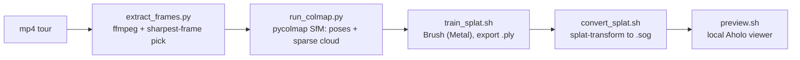

# Video to Gaussian Splat (Aholo-compatible, 100% local)

Turn an mp4 walkthrough into a 3D Gaussian splat and preview it in the browser,
entirely on-device. Thin wrappers drive four proven open-source tools; **you**
(the model) shepherd the run, judge reconstruction quality, and decide when to
commit to a full-length training run.



"Compatible with the Aholo viewer" just means a standard trained splat: Aholo
loads `PLY`, `SPZ`, `SOG`, `SPLAT`, `KSPLAT`, and `LCC`. We produce a lossless
`.ply` master plus a compact `.sog` for the web (the format Aholo and PlayCanvas
recommend for streaming).

Everything lives **outside the repo** under `~/.video-to-splat/` (venv, the Brush
binary, the viewer app, and per-project frames/models/splats). Nothing is ever
uploaded anywhere.

## Prerequisites

- **Apple Silicon Mac (M1-M4), macOS 14+.** Brush trains on the Apple GPU via
  WebGPU/Metal and the pycolmap wheels are macOS-14 arm64 - there is no CUDA/CPU
  fallback in this skill.
- **uv** (Python env). If missing: `curl -LsSf https://astral.sh/uv/install.sh | sh`.
- **ffmpeg** and **node/npx**: `brew install ffmpeg node`.
- **~3-5 GB free disk** for the Brush binary, pycolmap, and the viewer's npm deps
  (downloaded once). Internet is needed only for that first setup.
- A browser with **WebGPU**: **Chrome or Edge 134+** (Safari/Firefox won't render
  the preview yet).

## Setup

Resolve the skill directory and run setup once (creates the venv, downloads the
Brush binary, installs the viewer):

```bash
SKILL_DIR="<the folder this SKILL.md lives in>"   # e.g. .cursor/skills/video-to-splat
bash "$SKILL_DIR/scripts/setup_env.sh"
```

Then set the handles the scripts use (setup prints them too):

```bash
VTS_HOME="${VIDEO_TO_SPLAT_HOME:-$HOME/.video-to-splat}"
PY="$VTS_HOME/.venv/bin/python"
```

## Workflow

Copy this checklist and track progress:

```
- [ ] 1. Setup: run setup_env.sh (first time only)
- [ ] 2. Extract frames from the mp4 (extract_frames.py)
- [ ] 3. Recover camera poses + sparse cloud (run_colmap.py) - CHECK the % registered
- [ ] 4. Smoke-train ~2000 steps to validate poses before committing hours
- [ ] 5. Full train (train_splat.sh, default 30000 steps) -> splat.ply
- [ ] 6. Compress to .sog (convert_splat.sh)
- [ ] 7. Preview in the Aholo viewer (preview.sh) and deliver
```

### Step 2: Extract frames

```bash
"$PY" "$SKILL_DIR/scripts/extract_frames.py" /path/to/tour.mp4 --name my-tour --fps 2
```

- Oversamples, keeps the **sharpest frame per window** (rejects motion blur), and
  drops near-duplicate frames. Downscales the long side to 1600 px.
- Aim for **~50-200 well-spread, in-focus frames**. Raise `--fps` for a fast tour,
  lower it for a slow one. `--max-frames` caps the count (COLMAP time grows fast).
- Prints the project dir. Frames land in `~/.video-to-splat/projects/my-tour/images/`.

### Step 3: Camera poses (Structure-from-Motion)

```bash
"$PY" "$SKILL_DIR/scripts/run_colmap.py" my-tour            # sequential matcher (video)
# or, for small/loopy/unordered sets:
"$PY" "$SKILL_DIR/scripts/run_colmap.py" my-tour --matcher exhaustive
```

- This is the make-or-break step. **Read the reported "% registered".** If well
  under ~80%, the splat will only cover part of the scene - fix the capture or
  matching before training (see Anti-patterns and REFERENCE.md).
- Writes the COLMAP model to `projects/my-tour/sparse/0/`.

### Step 4: Smoke-train first (strongly recommended)

Poses are the usual failure point, and full training is slow. Validate cheaply:

```bash
bash "$SKILL_DIR/scripts/train_splat.sh" my-tour --steps 2000
bash "$SKILL_DIR/scripts/convert_splat.sh" my-tour
bash "$SKILL_DIR/scripts/preview.sh" my-tour
```

If the rough 2k-step splat already resembles the space, proceed to a full run. If
it's a cloud of noise, the poses are bad - revisit steps 2-3, don't burn hours.

### Step 5: Full training

```bash
bash "$SKILL_DIR/scripts/train_splat.sh" my-tour --steps 30000
```

- Trains with Brush and exports `projects/my-tour/splat.ply`.
- `--sh-degree 2` (default) keeps files smaller; raise to 3 for shinier view-
  dependent highlights at the cost of size. `--with-viewer` opens Brush's live
  training GUI (it won't auto-exit; use for interactive runs only).
- **Runtime is real**: roughly ~6 min per 1000 steps on an M-series Mac, so a 30k
  run is a couple of hours. Start it and do other work.

### Step 6: Compress for the web

```bash
bash "$SKILL_DIR/scripts/convert_splat.sh" my-tour            # writes splat.sog
bash "$SKILL_DIR/scripts/convert_splat.sh" my-tour --spz      # also emit .spz
```

`.sog` is typically ~10-20x smaller than the `.ply` with little visible loss. Add
`--cpu` if GPU compression fails.

### Step 7: Preview and deliver

```bash
bash "$SKILL_DIR/scripts/preview.sh" my-tour                  # opens Chrome/Edge
```

Starts a local Vite server with the bundled Aholo viewer (orbit: drag, pan:
shift/right-drag, zoom: wheel, reset: R). Deliverables live under
`~/.video-to-splat/projects/my-tour/`: `splat.ply` (master), `splat.sog` (web),
and the COLMAP model. To use in a real Aholo app, load the `.sog` with
`SplatLoader.parseSplatData(SplatFileType.SOG, url)` - see REFERENCE.md.

## Capture guidance (the #1 quality lever)

Reconstruction quality is set on the camera far more than in any flag:

- **Move slowly and steadily**; high shutter speed / bright light to avoid motion
  blur. Blurry frames get rejected, leaving gaps.
- **Overlap generously** - each part of the scene should appear in many frames
  from different angles. Orbit objects; don't just pan.
- **Loop back** to where you started so poses close up (helps a lot).
- **Lock exposure/focus** if you can; avoid mirrors, glass, water, and big
  textureless walls - SfM has nothing to latch onto there.
- Prefer a static scene: people/cars moving through confuse both SfM and training.

## Key options

| Script | Option | Default | Purpose |
|--------|--------|---------|---------|
| extract_frames.py | `--fps` | `2` | Target selected frames per second. |
| | `--max-frames` | `200` | Cap on frames (COLMAP time grows fast). |
| | `--max-size` | `1600` | Downscale long side (px). |
| | `--dedup-dist` | `4` | Drop near-duplicate frames (0 = keep all). |
| run_colmap.py | `--matcher` | `sequential` | `sequential` (video) or `exhaustive` (small/loopy). |
| | `--loop-detection` | off | Vocab-tree loop closure (needs `--vocab-tree`). |
| | `--multi-camera` | off | Per-image intrinsics instead of one shared camera. |
| train_splat.sh | `--steps` | `30000` | Training iterations (try `2000` to smoke-test). |
| | `--sh-degree` | `2` | SH degree 0-4 (higher = shinier + bigger). |
| | `--max-resolution` | `1600` | Cap training image long side. |
| | `--max-splats` | none | Hard cap on splat count. |
| | `--with-viewer` | off | Open Brush's live GUI (won't auto-exit). |
| convert_splat.sh | `--spz` | off | Also emit `.spz`. |
| | `--cpu` | off | Force CPU compression. |
| preview.sh | `--port` | `5173` | Vite port. |

## Anti-patterns

- **Skipping the quality check / smoke run.** Training for hours on bad poses is
  the most expensive mistake here. Read "% registered", then smoke-train 2k steps.
- **Feeding 1000+ frames into COLMAP.** Matching/mapping time explodes for little
  gain. 50-200 sharp, overlapping frames beats a dense dump.
- **Training at full 4K frames.** Leave `--max-resolution` at ~1600; huge images
  are slower and rarely help.
- **Expecting miracles from a fast pan.** Motion blur and thin overlap yield
  gaps and floaters - it's a capture problem, not a flag.
- **Committing anything under `~/.video-to-splat/`** or the trained assets into a
  repo. They're large and regenerable.
- **Uploading footage or splats to a hosting site.** Everything stays local; if a
  workflow ever needs a URL, ask the user first.

## Resources

- Tool matrix, licenses, Brush CLI flags, pycolmap notes, format/compatibility
  table, rejected alternatives, and troubleshooting: [REFERENCE.md](REFERENCE.md)
- Aholo viewer docs: https://aholojs.dev/ (AI docs at https://aholojs.dev/llms.txt)
