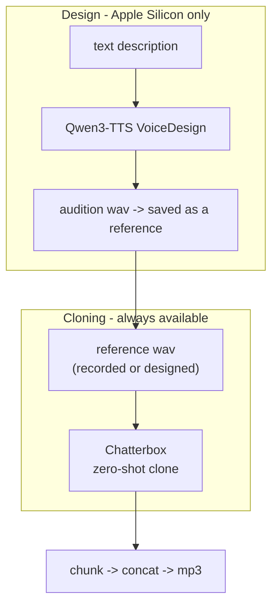

# Voice Clone Narration - Reference

Deep-dive on the models, the "design once, clone everywhere" architecture, tuning,
languages, chunking, troubleshooting, and why other TTS systems were rejected.

## Architecture

Two capabilities, one narration engine:

A **designed** voice is never a separate playback path: Qwen3-TTS only mints a short
audition clip, which is saved as a normal reference wav. All narration - recorded
or designed voice, English or Spanish - flows through **Chatterbox** cloning, so
quality, language coverage, and the `exaggeration`/`cfg_weight` controls behave
identically regardless of where the voice came from.

## Models

### Chatterbox (Resemble AI) - the narration engine

- **License:** MIT (code and weights) - usable commercially, including for paid
  reel/ad narration.
- **Cloning:** zero-shot from a short reference clip; no training/finetuning. The
  encoder uses up to ~6 s and the decoder up to ~10 s of the reference, so a clean
  7-15 s clip is ideal; extra length past ~10 s is ignored.
- **Watermark:** every output carries Resemble's imperceptible **PerTh** neural
  watermark (survives MP3 compression, ~100% detection). Responsible-AI feature;
  not removable in the open-source release.
- **Variants:**
  - `multilingual` (default) = `mlx-community/chatterbox-fp16` (~2.6 GB). 500M
    params, 23 languages, `exaggeration` + `cfg_weight` controls.
  - `turbo` = `mlx-community/chatterbox-turbo-fp16` (~350M, English-only). Native
    paralinguistic tags in the text: `[laugh]`, `[sigh]`, `[chuckle]`, `[cough]`,
    `[gasp]`, `[groan]`, `[sniff]`, `[shush]`, `[clear throat]`. Great for punchy
    English VO; pass `--model turbo`.
  - Single-language finetunes exist if generic Spanish ever needs more polish:
    `ResembleAI/Chatterbox-Multilingual-es-mx-latam` (LatAm) and
    `ResembleAI/Chatterbox-Multilingual-es-es` (Spain). Pass the repo id to
    `--model` (mlx path). Not needed for most work - the base multilingual model
    handles Spanish well.

### Qwen3-TTS VoiceDesign (Alibaba) - the voice inventor

- **License:** Apache-2.0.
- **Model:** `mlx-community/Qwen3-TTS-12Hz-1.7B-VoiceDesign-bf16` (~3.5 GB).
- **API:** `model.generate_voice_design(text=..., language="English", instruct="<description>")`.
- **Platform:** Apple Silicon only (via mlx-audio). No supported local design path
  on CUDA/CPU in this skill - use a recorded reference there instead.
- **Description tips:** cover gender, age, pitch, pace, timbre, and tone; add accent
  explicitly ("slight Mexican Spanish accent", "British RP"). Keep the audition
  short (1-2 sentences) - it only needs to seed the clone.

## Runtime backends

| Backend | When | Package | Notes |
|---------|------|---------|-------|
| **mlx** | Apple Silicon (Darwin/arm64) | `mlx-audio` | Fast (~2.4x vs PyTorch MPS); required for voice design. Chunk conditioning is reused for a consistent voice. |
| **torch** | Linux/Windows/Intel | `chatterbox-tts` | `ChatterboxMultilingualTTS` / `ChatterboxTurboTTS`; auto-picks `cuda`>`mps`>`cpu`. Cloning only (no design). |

`setup_env.sh` picks the backend automatically; override with `--backend` (setup)
or `VC_BACKEND`, and per-run with `narrate.py --backend`.

## Inflection tuning

- **`exaggeration` (0-1):** emotional intensity. `0.5` neutral; `0.7-0.8` dramatic;
  `0.3-0.4` flat/calm. Higher values also *speed up* delivery.
- **`cfg_weight` (0-1):** how strictly the output follows the reference's cadence.
  Lower = slower, more deliberate pacing. `0` removes reference-style guidance -
  the main lever to stop an English reference from bleeding its accent into Spanish.

| Goal | exaggeration | cfg_weight |
|------|--------------|------------|
| Neutral narration | 0.5 | 0.5 |
| Calm / documentary | 0.4 | 0.5 |
| Energetic / promo | 0.7 | 0.3 |
| Dramatic / trailer | 0.8 | 0.3 |
| Fast reference speaker | 0.5 | 0.3 |
| Cross-language (EN ref -> ES text) | 0.5 | 0.0 |

## Languages

Chatterbox multilingual supports 23 language codes (pass to `narrate.py --lang`):

`ar` Arabic, `da` Danish, `de` German, `el` Greek, `en` English, `es` Spanish,
`fi` Finnish, `fr` French, `he` Hebrew, `hi` Hindi, `it` Italian, `ja` Japanese,
`ko` Korean, `ms` Malay, `nl` Dutch, `no` Norwegian, `pl` Polish, `pt` Portuguese,
`ru` Russian, `sv` Swedish, `sw` Swahili, `tr` Turkish, `zh` Chinese.

Best practice: match the reference clip's language to the target language. If you
can't, set `--cfg-weight 0`. Turbo is English-only.

## Chunking

`narrate.py` splits on sentence boundaries (`.!?…`), packs sentences up to
`--max-chars` (default 280), and hard-splits any single over-long sentence on
commas/spaces. Each chunk is synthesized with the **same** reference conditioning
and settings, then chunks are joined with a 0.15 s silence gap and encoded once.

Why chunk: single-shot long text produces boundary artifacts and drift past
~15 s of audio. Chunking keeps each generation short and stable while the shared
speaker conditioning keeps the voice identical across the whole narration.

MP3 encoding: `ffmpeg -c:a libmp3lame -q:a <quality>` (VBR; `2` ~ 190 kbps, a good
voice default; raise the number for smaller files).

## Storage & privacy

- Data root: `~/.voice-clone-narration/` (`venv/`, `voices/`, `out/`). Override with
  `VOICE_CLONE_HOME`. Nothing is written into the repo.
- Model weights cache under `~/.cache/huggingface/`. Budget ~5 GB (clone) and
  ~3.5 GB more if design is used. Downloads are anonymous - no HF token.
- Reference wavs and outputs are local only. Never upload them (see SKILL.md
  Safety). Voice clones are biometric-adjacent - treat them as sensitive.

## Troubleshooting

| Symptom | Fix |
|---------|-----|
| `ffmpeg not found` | `brew install ffmpeg` (macOS) / `apt install ffmpeg`. |
| `no TTS backend installed` | Run `setup_env.sh`. |
| Voice design errors on non-Mac | Expected - design is Apple-Silicon-only; record a reference and use `prep_reference.sh`. |
| Spanish sounds English-accented | Use a Spanish reference, or `--cfg-weight 0`; or design a voice with the accent in `--describe`. |
| Cloned voice is off / robotic | Reference too short/noisy/quiet - re-prep a clean 7-15 s window with `--start/--duration`. |
| Generation is slow | First run downloads weights; subsequent runs are cached. On non-Mac CPU it's slow - use a CUDA box or Apple Silicon. |
| Output too loud/quiet | It mirrors the reference; prep a well-recorded clip. |
| First `setup`/run needs network | Only to fetch weights once; generation is offline after that. |
| torch install heavy on Linux | `chatterbox-tts` pulls torch/torchaudio; expect a large first install. |

## Why Chatterbox (rejected alternatives)

| System | Why not the default |
|--------|---------------------|
| **XTTS-v2 (Coqui)** | Great cloning, but Coqui Public Model License is **non-commercial** - unsuitable for paid reels. |
| **F5-TTS** | Excellent expressiveness and Spanish finetunes, but weights are **CC-BY-NC** (non-commercial). Good personal-use alternative. |
| **Kokoro-82M** | Fast and Apache-2.0, but **no voice cloning** (fixed voices only). |
| **CosyVoice / MOSS-TTS / Higgs** | Strong, but heavier and/or less clear licensing for commercial cloning on 16 GB; Chatterbox is lighter and MIT. |
| **Cloud APIs (ElevenLabs, etc.)** | Not local - violate the offline requirement. |

Chatterbox wins on the intersection of: MIT license, zero-shot cloning, English +
Spanish, Apple-Silicon support via mlx-audio, and a small footprint. Qwen3-TTS
VoiceDesign (Apache-2.0) complements it for inventing voices from a description.

## Sources

- Chatterbox: https://github.com/resemble-ai/chatterbox
- mlx-audio: https://github.com/Blaizzy/mlx-audio
- Chatterbox MLX weights: https://huggingface.co/mlx-community/chatterbox-fp16
- Qwen3-TTS VoiceDesign weights: https://huggingface.co/mlx-community/Qwen3-TTS-12Hz-1.7B-VoiceDesign-bf16
- PerTh watermarker: https://github.com/resemble-ai/perth
