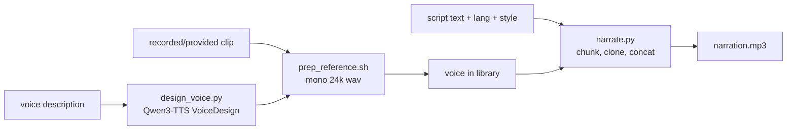

# Voice Clone Narration

Turn a script into a natural-sounding MP3 narration in a specific voice - either a
**cloned** voice (from a short reference clip) or a **designed** voice (invented
from a text description) - running entirely on the local machine. Built for reel
and demo-video voiceovers in English and Spanish.

One driver script does the generation; **you** (the model) are the glue: confirm
the voice source, prep it, pick the inflection, and deliver the mp3.



Voice samples and generated audio live **outside the repo** at
`~/.voice-clone-narration/` (`voices/`, `out/`, `venv/`). Voice clones are
biometric-adjacent data - see [Safety](#safety).

## Prerequisites

- **Python 3.11** available (via `uv`, preferred, or `python3.11`). First run
  creates a dedicated venv; no global installs.
- **ffmpeg** on PATH (mp3 encoding). Stop and ask the user to `brew install ffmpeg`
  if missing.
- **~5 GB free disk** for model weights (downloaded once from Hugging Face,
  anonymously - no token needed) plus **~3.5 GB more** if voice design is used.
- **Apple Silicon Mac** for the fast path (mlx-audio) and for **voice design**
  (Qwen3-TTS VoiceDesign is Apple-Silicon only). On other platforms the skill
  falls back to a PyTorch/CPU/CUDA build of Chatterbox for cloning; design is
  unavailable there.
- Internet on first run only (to fetch weights). Generation itself is offline.

## Setup

Resolve the skill directory (wherever it was installed) and run setup once:

```bash
SKILL_DIR="<the folder this SKILL.md lives in>"   # e.g. .cursor/skills/voice-clone-narration
bash "$SKILL_DIR/scripts/setup_env.sh"
```

`setup_env.sh` creates `~/.voice-clone-narration/venv`, installs the right backend
for the platform (**mlx-audio** on Apple Silicon, **chatterbox-tts** elsewhere),
verifies ffmpeg, and prints the chosen backend. It is idempotent - safe to re-run.

Then set two handles used by every phase:

```bash
VC_HOME="${VOICE_CLONE_HOME:-$HOME/.voice-clone-narration}"
PY="$VC_HOME/venv/bin/python"
```

## Workflow

Copy this checklist and track progress:

```
- [ ] 1. Confirm the voice source: provided clip, a text description, or an existing saved voice
- [ ] 2. Setup: run setup_env.sh (first time only)
- [ ] 3. Get a voice: prep_reference.sh (a clip) and/or design_voice.py (a description)
- [ ] 4. Confirm the script text, language (en/es), and desired tone
- [ ] 5. Narrate: narrate.py -> single mp3
- [ ] 6. Deliver the mp3 (embed/link it); clean up temp wavs unless asked to keep
```

### Step 1: Pick the voice source

Ask the user which one applies (if not already clear):

| Source | Use | Phase |
|--------|-----|-------|
| A recording of a real voice (theirs, or one they have rights to) | Clone an actual person | [Prep a reference](#step-3a-prep-a-reference-clip) |
| A text description ("deep warm male narrator, 40s, calm") | Invent a new synthetic voice | [Design a voice](#step-3b-design-a-voice-apple-silicon) |
| A voice already saved from a previous run | Reuse | skip to [Narrate](#step-4-narrate) |

For cloning a real person, **require consent** (see [Safety](#safety)).

### Step 3a: Prep a reference clip

Convert any recording (wav/mp3/m4a/mov/...) into a clean reference in the voice
library. The sweet spot is **~7-15 s of clean, single-speaker speech** (no music,
minimal noise).

```bash
bash "$SKILL_DIR/scripts/prep_reference.sh" <voice-name> <input-audio> [--start SS] [--duration SS]
# e.g. take 12s starting at 3s from a memo:
bash "$SKILL_DIR/scripts/prep_reference.sh" pablo ~/Desktop/memo.m4a --start 3 --duration 12
```

It writes mono 24 kHz `~/.voice-clone-narration/voices/<voice-name>.wav` and warns
if the clip is too short/long or too quiet. Trim to the cleanest window with
`--start`/`--duration`.

### Step 3b: Design a voice (Apple Silicon)

Invent a new voice from a description. This synthesizes a short audition and saves
it as a normal reference voice, so narration still runs through the same cloning
pipeline ("design once, clone everywhere").

```bash
"$PY" "$SKILL_DIR/scripts/design_voice.py" \
  --name narrator1 \
  --describe "A deep, warm male voice in his 40s, calm and measured pace, friendly documentary tone." \
  --audition-text "Here's what this voice sounds like when it tells a short story."
```

It saves `voices/narrator1.wav` (the reference) and an
`out/narrator1-audition.mp3` you should **play/link for the user to approve**. If
they want changes, re-run with an adjusted `--describe` (tweak pitch, age, pace,
accent - e.g. "...with a slight Mexican Spanish accent"). Put accent/character in
the description; the description language can be English even if you will later
narrate in Spanish.

### Step 4: Narrate

Generate the mp3 from the script. `--voice` accepts a saved voice name or a path
to a wav.

```bash
"$PY" "$SKILL_DIR/scripts/narrate.py" \
  --voice narrator1 \
  --lang en \
  --text "Meet Acme - the fastest way to ship your next idea. In just three steps, you're live." \
  --exaggeration 0.5 --cfg-weight 0.5 \
  --out ~/Desktop/acme-reel.mp3
```

For a real script, use `--text-file script.txt`. Long scripts are automatically
split into sentence chunks (same voice + settings across all of them),
concatenated, and encoded to one mp3.

#### Inflection presets

Two knobs shape delivery: `--exaggeration` (emotional intensity) and `--cfg-weight`
(how strictly it follows the reference's cadence; lower = slower, more deliberate).

| Tone | `--exaggeration` | `--cfg-weight` | When |
|------|------------------|----------------|------|
| Neutral narration (default) | `0.5` | `0.5` | Explainers, tutorials, most VO |
| Calm / documentary | `0.4` | `0.5` | Soft, measured, trustworthy |
| Energetic / promo | `0.7` | `0.3` | Punchy reel hooks, ads |
| Dramatic | `0.8` | `0.3` | Trailer-style, high emotion |

Higher exaggeration speeds speech up; drop `cfg-weight` to compensate with slower
pacing.

#### Spanish

Pass `--lang es`. For the most natural result, the **reference clip should be the
same language** as the script (a Spanish clip for Spanish narration). If you only
have an English reference (or a designed voice), set `--cfg-weight 0` to reduce
English-accent bleed into the Spanish. A designed voice can bake the accent into
its description (e.g. "slight Mexican Spanish accent").

```bash
"$PY" "$SKILL_DIR/scripts/narrate.py" --voice narrator1 --lang es \
  --text "Conoce Acme, la forma mas rapida de lanzar tu proxima idea." \
  --cfg-weight 0.3 --out ~/Desktop/acme-es.mp3
```

### Step 6: Deliver

The script prints the output path and duration. Embed or link the mp3 for the
user. Per-chunk temp wavs are deleted unless you pass `--keep-wav`.

## Key options (narrate.py)

| Option | Default | Purpose |
|--------|---------|---------|
| `--voice` | (required) | Saved voice name or path to a reference wav. |
| `--text` / `--text-file` | (one required) | The script to narrate. |
| `--lang` | `en` | Language code (`en`, `es`, ... 23 supported - see REFERENCE). |
| `--exaggeration` | `0.5` | Emotional intensity (0-1). |
| `--cfg-weight` | `0.5` | Cadence adherence; lower = slower/more deliberate; `0` avoids accent transfer. |
| `--out` | `out/narration-<ts>.mp3` | Output mp3 path. |
| `--model` | `multilingual` | `multilingual` (EN+ES+21 more) or `turbo` (English-only, supports `[laugh]`/`[sigh]` tags) or a full HF repo id. |
| `--max-chars` | `280` | Target max characters per chunk. |
| `--mp3-quality` | `2` | ffmpeg `libmp3lame -q:a` VBR quality (0=best, 9=smallest). |
| `--keep-wav` | off | Keep the intermediate wav next to the mp3. |
| `--backend` | `auto` | `auto` / `mlx` / `torch`. |

## Safety

- **Consent is mandatory for cloning a real person.** Only clone a voice the user
  owns or has explicit permission to use. If unclear, ask before prepping a clip.
  Do not clone public figures to impersonate them.
- **Never upload** voice samples, reference wavs, or generated audio to any
  external service. Everything stays under `~/.voice-clone-narration/`. If a
  workflow ever needs a hosted URL, stop and ask the user first.
- **Watermark disclosure:** every Chatterbox output carries Resemble AI's
  imperceptible **PerTh** neural watermark (survives mp3 compression). This is a
  responsible-AI feature, not removable; mention it if the user asks about
  provenance or plans to represent the audio as a real human recording.
- **Label synthetic media** where the platform or context calls for it.

## Anti-patterns

- Cloning a voice without confirming the user has the right to use it.
- Feeding a whole multi-paragraph script as one blob to a raw model - use
  `narrate.py`, which chunks and keeps the voice consistent (raw single-shot long
  text produces boundary artifacts).
- Using a noisy/music-backed or 1-2 second reference clip - cloning quality
  collapses. Prep a clean ~10 s window.
- Using `--lang es` with an English reference and default `cfg-weight` - the
  Spanish inherits an English accent; drop `--cfg-weight` toward `0`.
- Expecting voice **design** to work off Apple Silicon - it requires mlx-audio.
  Fall back to a recorded reference there.
- Committing anything from `~/.voice-clone-narration/` into a repo.

## Resources

- Model choices, the "design once, clone everywhere" rationale, tuning cheatsheet,
  supported languages, chunking details, troubleshooting, and why other TTS
  systems were rejected: [REFERENCE.md](REFERENCE.md)
- Verifying/among generated audio narration in a video: the **review-mp4** skill.
